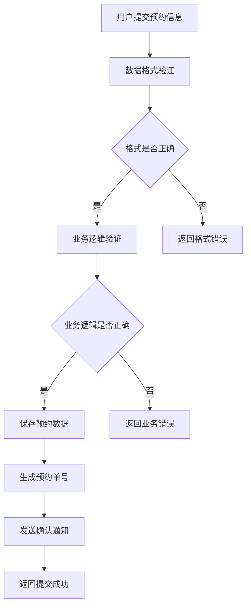

# 企业产品预约提交接口

## 1. 接口概述

企业产品预约提交接口是企业产品预约模块的核心接口，负责处理用户的产品预约信息提交，包括产品规格、用户信息、安装地址等完整预约数据的处理和存储。

### 1.1 接口定位
- **接口类型**：业务提交类接口
- **服务对象**：信息填写页面、预约成功页面
- **核心价值**：提供完整的产品预约信息提交和处理服务

### 1.2 接口特点
- **数据完整**：处理完整的预约信息数据
- **业务逻辑**：包含完整的预约业务逻辑处理
- **数据验证**：全面的数据验证和格式检查
- **状态管理**：完整的预约状态管理和跟踪

## 2. 业务流程

### 2.1 提交流程


## 3. 功能特点

### 3.1 数据处理功能
- **预约信息处理**：处理完整的预约信息数据
- **产品信息关联**：关联产品规格和配置信息
- **用户信息处理**：处理用户基本信息和联系方式
- **地址信息处理**：处理安装地址和详细地址信息

### 3.2 业务逻辑功能
- **预约状态管理**：管理预约的各个状态
- **重复预约检查**：检查用户是否重复预约
- **库存检查**：检查产品库存和可用性
- **预约单生成**：生成唯一的预约单号

### 3.3 通知功能
- **确认通知**：发送预约确认通知
- **状态更新通知**：发送预约状态更新通知
- **提醒通知**：发送预约提醒通知

## 4. API接口

### 4.1 接口基本信息
- **接口名称**：企业产品预约提交接口
- **英文名称**：Submit Product Reservation
- **调用地址**：`/api/reservation/submitReservation`
- **请求方式**：POST
- **接口版本**：v1.0
- **接口状态**：已发布

### 4.2 请求参数

#### 4.2.1 请求头参数
| 参数名 | 类型 | 必填 | 说明 |
|--------|------|------|------|
| Content-Type | String | 是 | application/json |
| Authorization | String | 否 | Bearer Token |

#### 4.2.2 请求体参数
| 参数名 | 类型 | 必填 | 说明 | 示例值 |
|--------|------|------|------|--------|
| productInfo | Object | 是 | 产品信息 | - |
| userInfo | Object | 是 | 用户信息 | - |
| addressInfo | Object | 是 | 地址信息 | - |
| remark | String | 否 | 备注信息 | "测试预约" |

#### 4.2.3 产品信息参数
| 参数名 | 类型 | 必填 | 说明 | 示例值 |
|--------|------|------|------|--------|
| productId | String | 是 | 产品ID | "PROD_001" |
| packetType | String | 是 | 套餐类型 | "month" |
| price | Number | 是 | 价格 | 40 |
| bandwidth | String | 是 | 带宽 | "100M" |
| tv | String | 是 | 电视配置 | "商务电视IPTV" |
| screen | String | 是 | 屏幕定制 | "屏幕定制标准版" |

#### 4.2.4 用户信息参数
| 参数名 | 类型 | 必填 | 说明 | 示例值 |
|--------|------|------|------|--------|
| customerName | String | 是 | 客户姓名 | "张三" |
| customerPhone | String | 是 | 客户电话 | "13800138000" |

#### 4.2.5 地址信息参数
| 参数名 | 类型 | 必填 | 说明 | 示例值 |
|--------|------|------|------|--------|
| city | String | 是 | 城市 | "广州市" |
| installAddress | String | 是 | 安装地址 | "测试楼宇" |
| building | String | 是 | 楼栋 | "6栋" |
| room | String | 是 | 房间号 | "601" |

### 4.3 响应参数

#### 4.3.1 成功响应
```json
{
  "code": 200,
  "message": "预约提交成功",
  "data": {
    "reservationId": "RES_20241220001",
    "reservationStatus": "pending",
    "submitTime": "2024-12-20T17:30:00Z",
    "estimatedProcessTime": "1-3个工作日",
    "contactInfo": {
      "customerServicePhone": "400-123-4567",
      "customerServiceEmail": "service@example.com"
    }
  }
}
```

#### 4.3.2 错误响应
```json
{
  "code": 400,
  "message": "预约提交失败",
  "data": null,
  "errors": [
    {
      "field": "customerPhone",
      "message": "手机号码格式不正确"
    }
  ]
}
```

## 5. 关联的数据库表

### 5.1 个人预约订单表
- **表名称**：t_gr_reservation_order
- **主要字段**：订单ID、用户ID、产品ID、预约信息、订单状态等
- **用途**：存储预约订单信息

### 5.2 省级产品信息表
- **表名称**：t_iqimall_product
- **主要字段**：产品ID、产品名称、价格、状态、创建时间等
- **用途**：存储智慧酒店包产品的基本信息

### 5.3 省级产品拓展信息表
- **表名称**：t_iqimall_product_ext_attr
- **主要字段**：产品ID、规格配置、套餐类型、带宽选项等
- **用途**：存储产品的扩展属性和规格配置信息

## 6. 测试要求

### 6.1 测试用例文档
- **完整测试用例**：[智慧酒店包产品详情页测试用例](https://scn19pp095sm.feishu.cn/base/Y6CZbC4HWaotEds1azBcsW0hnAg?from=from_copylink)

### 6.2 测试分类概览

#### 6.2.1 功能测试
- **正常提交测试**：验证正常预约信息提交
- **参数验证测试**：验证请求参数的格式和内容
- **业务逻辑测试**：验证预约业务逻辑的正确性
- **数据完整性测试**：验证预约数据的完整性

#### 6.2.2 性能测试
- **提交速度测试**：测试预约提交的处理速度
- **并发测试**：测试并发预约提交的处理能力
- **数据量测试**：测试大量预约数据的处理
- **响应时间测试**：测试接口的响应时间

#### 6.2.3 安全测试
- **数据安全测试**：验证预约数据的安全性
- **权限控制测试**：验证接口访问权限控制
- **输入验证测试**：验证输入数据的安全性
- **防重复提交测试**：验证防重复提交机制

## 7. 使用说明

### 7.1 接口调用示例

#### 7.1.1 JavaScript调用示例
```javascript
// 提交预约信息
async function submitReservation(reservationData) {
  try {
    const response = await fetch('/api/reservation/submitReservation', {
      method: 'POST',
      headers: {
        'Content-Type': 'application/json',
        'Authorization': 'Bearer ' + getAccessToken()
      },
      body: JSON.stringify(reservationData)
    });
    
    const result = await response.json();
    if (result.code === 200) {
      return result.data;
    } else {
      throw new Error(result.message);
    }
  } catch (error) {
    console.error('预约提交失败:', error);
    throw error;
  }
}

// 预约数据示例
const reservationData = {
  productInfo: {
    productId: "PROD_001",
    packetType: "month",
    price: 40,
    bandwidth: "100M",
    tv: "商务电视IPTV",
    screen: "屏幕定制标准版"
  },
  userInfo: {
    customerName: "张三",
    customerPhone: "13800138000"
  },
  addressInfo: {
    city: "广州市",
    installAddress: "测试楼宇",
    building: "6栋",
    room: "601"
  },
  remark: "测试预约"
};
```

### 7.2 注意事项
- 确保所有必填参数都已提供
- 验证手机号码格式的正确性
- 注意预约数据的完整性和准确性
- 及时处理接口返回的错误信息

## 8. Mock数据

### 8.1 成功响应Mock数据
```json
{
  "code": 200,
  "message": "预约提交成功",
  "data": {
    "reservationId": "RES_20241220001",
    "reservationStatus": "pending",
    "submitTime": "2024-12-20T17:30:00Z",
    "estimatedProcessTime": "1-3个工作日",
    "contactInfo": {
      "customerServicePhone": "400-123-4567",
      "customerServiceEmail": "service@example.com"
    }
  }
}
```

### 8.2 错误响应Mock数据
```json
{
  "code": 400,
  "message": "预约提交失败",
  "data": null,
  "errors": [
    {
      "field": "customerPhone",
      "message": "手机号码格式不正确"
    }
  ]
}
```

### 8.3 请求参数Mock数据
```json
{
  "productInfo": {
    "productId": "PROD_001",
    "packetType": "month",
    "price": 40,
    "bandwidth": "100M",
    "tv": "商务电视IPTV",
    "screen": "屏幕定制标准版"
  },
  "userInfo": {
    "customerName": "张三",
    "customerPhone": "13800138000"
  },
  "addressInfo": {
    "city": "广州市",
    "installAddress": "测试楼宇",
    "building": "6栋",
    "room": "601"
  },
  "remark": "测试预约"
}
```

### 8.4 Mock服务配置
```javascript
// Mock.js 配置示例
Mock.mock('/api/reservation/submitReservation', 'post', {
  code: 200,
  message: '预约提交成功',
  data: {
    reservationId: 'RES_@date("yyyyMMdd")@integer(100, 999)',
    reservationStatus: 'pending',
    submitTime: '@datetime',
    estimatedProcessTime: '@pick(["1-3个工作日", "3-5个工作日", "5-7个工作日"])',
    contactInfo: {
      customerServicePhone: '400-123-4567',
      customerServiceEmail: 'service@example.com'
    }
  }
});

// 错误情况Mock
Mock.mock('/api/reservation/submitReservation', 'post', function(options) {
  const body = JSON.parse(options.body);
  
  // 模拟验证逻辑
  if (!body.userInfo.customerPhone || !/^1[3-9]\d{9}$/.test(body.userInfo.customerPhone)) {
    return {
      code: 400,
      message: '预约提交失败',
      data: null,
      errors: [
        {
          field: 'customerPhone',
          message: '手机号码格式不正确'
        }
      ]
    };
  }
  
  return {
    code: 200,
    message: '预约提交成功',
    data: {
      reservationId: 'RES_' + new Date().toISOString().slice(0, 10).replace(/-/g, '') + Math.floor(Math.random() * 1000),
      reservationStatus: 'pending',
      submitTime: new Date().toISOString(),
      estimatedProcessTime: '1-3个工作日',
      contactInfo: {
        customerServicePhone: '400-123-4567',
        customerServiceEmail: 'service@example.com'
      }
    }
  };
});
```

## 9. 更新记录

### 版本1.0.0 (2024-12-20)
- 创建接口初始版本
- 定义接口基本规范和参数
- 完善接口文档和测试用例
- 增加Mock数据支持

## 10. 相关文档

- [接口工程文档](./接口工程.md)
- [需求01-商品模板化需求](../需求01-商品模板化需求.md)
- [企业产品预约模块](../模块01-企业产品预约模块/企业产品预约模块.md)

## 10. 联系方式

如有问题或建议，请联系开发团队。
