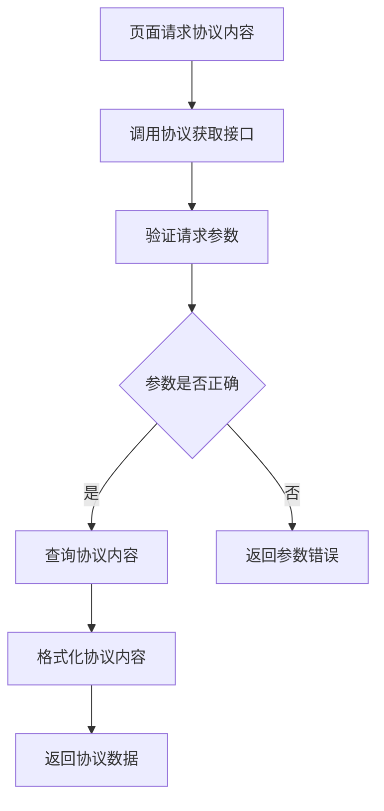

# 协议获取接口

## 1. 接口概述

协议获取接口是企业产品订购模块的协议内容获取接口，提供防范电信网络诈骗承诺书等协议内容的获取服务，支持温馨提示页面的协议展示功能。

### 1.1 接口定位
- **接口类型**：数据获取类接口
- **服务对象**：温馨提示页面
- **核心价值**：提供协议内容的获取和展示服务

### 1.2 接口特点
- **内容完整**：提供完整的协议内容
- **版本管理**：支持协议版本管理
- **格式标准**：标准化的协议内容格式
- **实时更新**：支持协议内容的实时更新

## 2. 业务流程

### 2.1 获取流程


## 3. 功能特点

### 3.1 内容获取功能
- **协议内容获取**：获取完整的协议内容
- **版本管理**：支持协议版本管理
- **格式处理**：处理协议内容的格式
- **内容验证**：验证协议内容的完整性

### 3.2 内容管理功能
- **内容更新**：支持协议内容的更新
- **历史版本**：保留协议的历史版本
- **内容审核**：协议内容的审核机制
- **发布管理**：协议内容的发布管理

## 4. API接口

### 4.1 接口基本信息
- **接口名称**：协议获取接口
- **英文名称**：Get Agreement
- **调用地址**：`/api/agreement/getAgreement`
- **请求方式**：GET/POST
- **接口版本**：v1.0
- **接口状态**：已发布

### 4.2 请求参数

#### 4.2.1 请求头参数
| 参数名 | 类型 | 必填 | 说明 |
|--------|------|------|------|
| Content-Type | String | 是 | application/json |

#### 4.2.2 请求体参数
| 参数名 | 类型 | 必填 | 说明 | 示例值 |
|--------|------|------|------|--------|
| agreementType | String | 是 | 协议类型 | "fraud_prevention" |
| version | String | 否 | 协议版本 | "v1.0" |

### 4.3 响应参数

#### 4.3.1 成功响应
```json
{
  "code": 200,
  "message": "获取成功",
  "data": {
    "agreementType": "fraud_prevention",
    "version": "v1.0",
    "title": "防范电信网络诈骗承诺书",
    "content": "防范电信网络诈骗承诺书内容...",
    "effectiveDate": "2024-01-01",
    "lastUpdated": "2024-12-20T17:30:00Z"
  }
}
```

## 5. 测试要求

### 5.1 测试用例文档
- **完整测试用例**：[智慧酒店包产品详情页测试用例](https://scn19pp095sm.feishu.cn/base/Y6CZbC4HWaotEds1azBcsW0hnAg?from=from_copylink)

### 5.2 测试分类概览

#### 5.2.1 功能测试
- **协议获取测试**：验证协议内容获取功能
- **版本管理测试**：验证协议版本管理功能
- **内容完整性测试**：验证协议内容的完整性
- **格式验证测试**：验证协议内容格式

## 6. 使用说明

### 6.1 接口调用示例

#### 6.1.1 JavaScript调用示例
```javascript
// 获取协议内容
async function getAgreement(agreementType, version) {
  try {
    const response = await fetch('/api/agreement/getAgreement', {
      method: 'POST',
      headers: {
        'Content-Type': 'application/json'
      },
      body: JSON.stringify({
        agreementType: agreementType,
        version: version
      })
    });
    
    const result = await response.json();
    if (result.code === 200) {
      return result.data;
    } else {
      throw new Error(result.message);
    }
  } catch (error) {
    console.error('获取协议失败:', error);
    throw error;
  }
}
```

## 7. Mock数据

### 7.1 成功响应Mock数据
```json
{
  "code": 200,
  "message": "获取成功",
  "data": {
    "agreementType": "fraud_prevention",
    "version": "v1.0",
    "title": "防范电信网络诈骗承诺书",
    "content": "防范电信网络诈骗承诺书内容...",
    "effectiveDate": "2024-01-01",
    "lastUpdated": "2024-12-20T17:30:00Z"
  }
}
```

### 7.2 请求参数Mock数据
```json
{
  "agreementType": "fraud_prevention",
  "version": "v1.0"
}
```

### 7.3 Mock服务配置
```javascript
// Mock.js 配置示例
Mock.mock('/api/agreement/getAgreement', 'post', {
  code: 200,
  message: '获取成功',
  data: {
    agreementType: 'fraud_prevention',
    version: 'v1.0',
    title: '防范电信网络诈骗承诺书',
    content: '@cparagraph(5, 10)',
    effectiveDate: '@date("yyyy-MM-dd")',
    lastUpdated: '@datetime'
  }
});
```

## 8. 更新记录

### 版本1.0.0 (2024-12-20)
- 创建接口初始版本
- 定义接口基本规范和参数
- 完善接口文档和测试用例
- 增加Mock数据支持

## 9. 相关文档

- [接口工程文档](./接口工程.md)
- [需求01-商品模板化需求](../需求01-商品模板化需求.md)
- [温馨提示页面](../模块02-企业产品订购模块/原型04-温馨提示页面/温馨提示页面.md)

## 9. 联系方式

如有问题或建议，请联系开发团队。
