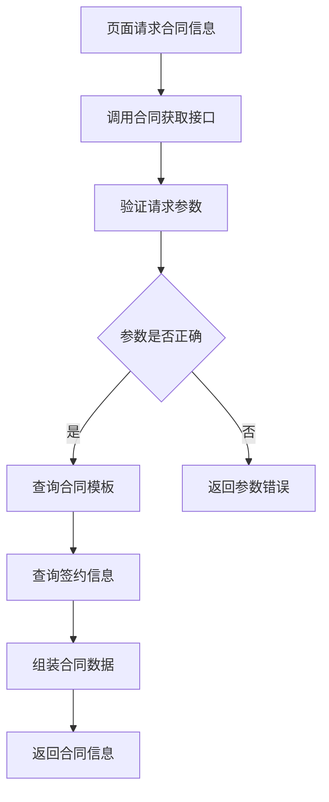

# 合同获取接口

## 1. 接口概述

合同获取接口是企业产品订购模块的合同信息获取接口，提供合同模板和签约信息的获取服务，支持合同上传页面的合同展示和签约流程。

### 1.1 接口定位
- **接口类型**：数据获取类接口
- **服务对象**：合同上传页面
- **核心价值**：提供合同模板和签约信息的获取服务

### 1.2 接口特点
- **模板管理**：提供标准化的合同模板
- **签约信息**：提供完整的签约信息
- **版本控制**：支持合同版本管理
- **个性化**：支持个性化的合同内容

## 2. 业务流程

### 2.1 获取流程


## 3. 功能特点

### 3.1 合同管理功能
- **模板获取**：获取标准化的合同模板
- **签约信息**：获取签约相关信息
- **版本管理**：支持合同版本管理
- **内容定制**：支持合同内容的个性化定制

### 3.2 信息处理功能
- **数据组装**：组装完整的合同信息
- **格式处理**：处理合同内容的格式
- **内容验证**：验证合同内容的完整性
- **权限控制**：控制合同信息的访问权限

## 4. API接口

### 4.1 接口基本信息
- **接口名称**：合同获取接口
- **英文名称**：Get Contract
- **调用地址**：`/api/contract/getContract`
- **请求方式**：GET/POST
- **接口版本**：v1.0
- **接口状态**：已发布

### 4.2 请求参数

#### 4.2.1 请求头参数
| 参数名 | 类型 | 必填 | 说明 |
|--------|------|------|------|
| Content-Type | String | 是 | application/json |
| Authorization | String | 是 | Bearer Token |

#### 4.2.2 请求体参数
| 参数名 | 类型 | 必填 | 说明 | 示例值 |
|--------|------|------|------|--------|
| userId | String | 是 | 用户ID | "USER_001" |
| productId | String | 是 | 产品ID | "PROD_001" |
| contractType | String | 是 | 合同类型 | "service" |

### 4.3 响应参数

#### 4.3.1 成功响应
```json
{
  "code": 200,
  "message": "获取成功",
  "data": {
    "contractId": "CONTRACT_001",
    "contractType": "service",
    "template": "合同模板内容...",
    "signingInfo": {
      "signingMethod": ["online", "offline"],
      "requiredDocuments": ["身份证", "营业执照"],
      "processDescription": "签约流程说明..."
    },
    "effectiveDate": "2024-01-01",
    "lastUpdated": "2024-12-20T17:30:00Z"
  }
}
```

## 5. 测试要求

### 5.1 测试用例文档
- **完整测试用例**：[智慧酒店包产品详情页测试用例](https://scn19pp095sm.feishu.cn/base/Y6CZbC4HWaotEds1azBcsW0hnAg?from=from_copylink)

### 5.2 测试分类概览

#### 5.2.1 功能测试
- **合同获取测试**：验证合同信息获取功能
- **模板管理测试**：验证合同模板管理功能
- **签约信息测试**：验证签约信息获取功能
- **权限控制测试**：验证合同访问权限控制

## 6. 使用说明

### 6.1 接口调用示例

#### 6.1.1 JavaScript调用示例
```javascript
// 获取合同信息
async function getContract(userId, productId, contractType) {
  try {
    const response = await fetch('/api/contract/getContract', {
      method: 'POST',
      headers: {
        'Content-Type': 'application/json',
        'Authorization': 'Bearer ' + getAccessToken()
      },
      body: JSON.stringify({
        userId: userId,
        productId: productId,
        contractType: contractType
      })
    });
    
    const result = await response.json();
    if (result.code === 200) {
      return result.data;
    } else {
      throw new Error(result.message);
    }
  } catch (error) {
    console.error('获取合同失败:', error);
    throw error;
  }
}
```

## 7. Mock数据

### 7.1 成功响应Mock数据
```json
{
  "code": 200,
  "message": "获取成功",
  "data": {
    "contractId": "CONTRACT_001",
    "contractType": "service",
    "template": "合同模板内容...",
    "signingInfo": {
      "signingMethod": ["online", "offline"],
      "requiredDocuments": ["身份证", "营业执照"],
      "processDescription": "签约流程说明..."
    },
    "effectiveDate": "2024-01-01",
    "lastUpdated": "2024-12-20T17:30:00Z"
  }
}
```

### 7.2 请求参数Mock数据
```json
{
  "userId": "USER_001",
  "productId": "PROD_001",
  "contractType": "service"
}
```

### 7.3 Mock服务配置
```javascript
// Mock.js 配置示例
Mock.mock('/api/contract/getContract', 'post', {
  code: 200,
  message: '获取成功',
  data: {
    contractId: 'CONTRACT_@integer(100, 999)',
    contractType: 'service',
    template: '@cparagraph(10, 20)',
    signingInfo: {
      signingMethod: ['online', 'offline'],
      requiredDocuments: ['身份证', '营业执照', '授权委托书'],
      processDescription: '@cparagraph(3, 5)'
    },
    effectiveDate: '@date("yyyy-MM-dd")',
    lastUpdated: '@datetime'
  }
});
```

## 8. 更新记录

### 版本1.0.0 (2024-12-20)
- 创建接口初始版本
- 定义接口基本规范和参数
- 完善接口文档和测试用例
- 增加Mock数据支持

## 9. 相关文档

- [接口工程文档](./接口工程.md)
- [需求01-商品模板化需求](../需求01-商品模板化需求.md)
- [合同上传页面](../模块02-企业产品订购模块/原型06-合同上传页面/合同上传页面.md)

## 9. 联系方式

如有问题或建议，请联系开发团队。
