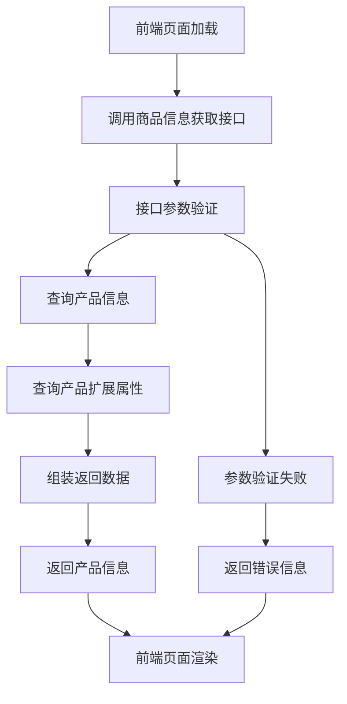

# 商品信息获取接口

## 1. 接口概述

商品信息获取接口是智慧酒店包产品展示和规格选择的核心接口，提供完整的产品信息、价格配置、规格选项等数据，支持前端页面的产品展示和用户交互。

### 1.1 接口定位
- **接口类型**：数据获取类接口
- **服务对象**：产品详情页、规格选择弹窗、信息填写页面
- **核心价值**：提供完整的产品信息数据支持

### 1.2 接口特点
- **数据完整**：提供产品基本信息、价格配置、规格选项
- **实时更新**：支持产品信息的实时更新
- **灵活配置**：支持多种产品规格和价格档位
- **高效响应**：优化的数据结构和响应速度

## 2. 业务流程

### 2.1 接口调用流程


### 2.2 数据获取流程

#### 2.2.1 产品基本信息获取
1. **查询主表**：从t_iqimall_product表获取产品基本信息
2. **数据验证**：验证产品状态和可用性
3. **信息组装**：组装产品名称、价格、状态等信息

#### 2.2.2 产品扩展属性获取
1. **查询扩展表**：从t_iqimall_product_ext_attr表获取扩展属性
2. **规格配置**：获取套餐类型、带宽选项等配置
3. **价格配置**：获取价格档位和联动规则

#### 2.2.3 数据整合流程
1. **数据合并**：合并主表和扩展表数据
2. **格式转换**：转换为前端需要的格式
3. **数据返回**：返回完整的产品信息

## 3. 功能特点

### 3.1 数据获取功能
- **产品基本信息**：产品ID、名称、价格、状态等
- **规格配置信息**：套餐类型、价格档位、带宽选项
- **联动规则配置**：价格与带宽的联动关系
- **图片资源信息**：产品图片、banner图片等

### 3.2 数据验证功能
- **参数验证**：验证请求参数的格式和内容
- **权限验证**：验证用户访问权限
- **数据完整性验证**：验证返回数据的完整性
- **缓存验证**：验证缓存数据的有效性

### 3.3 性能优化功能
- **数据缓存**：支持产品信息的缓存机制
- **分页查询**：支持大量数据的分页查询
- **索引优化**：优化的数据库查询索引
- **响应压缩**：支持响应数据的压缩传输

## 4. API接口

### 4.1 接口基本信息
- **接口名称**：商品信息获取接口
- **英文名称**：Get Product Information
- **调用地址**：`/api/product/getProductInfo`
- **请求方式**：GET/POST
- **接口版本**：v1.0
- **接口状态**：已发布

### 4.2 请求参数

#### 4.2.1 请求头参数
| 参数名 | 类型 | 必填 | 说明 |
|--------|------|------|------|
| Content-Type | String | 是 | application/json |
| Authorization | String | 否 | Bearer Token |
| User-Agent | String | 否 | 客户端标识 |

#### 4.2.2 请求体参数
| 参数名 | 类型 | 必填 | 说明 | 示例值 |
|--------|------|------|------|--------|
| productId | String | 是 | 产品ID | "PROD_001" |
| includeExtAttr | Boolean | 否 | 是否包含扩展属性 | true |
| includePriceConfig | Boolean | 否 | 是否包含价格配置 | true |

### 4.3 响应参数

#### 4.3.1 成功响应
```json
{
  "code": 200,
  "message": "success",
  "data": {
    "productId": "PROD_001",
    "productName": "智慧酒店包",
    "productPrice": 40,
    "productStatus": "active",
    "productImage": "banner.jpg",
    "productDescription": "智慧酒店包产品描述",
    "extAttributes": {
      "packageTypes": ["month", "year"],
      "priceConfig": {
        "month": [40, 50, 80, 100, 120],
        "year": [400, 500, 800, 1000, 1200]
      },
      "bandwidthOptions": ["100M", "200M", "300M", "600M", "1000M"],
      "skuConfig": {
        "month": {
          "40": ["100M"],
          "50": ["200M"],
          "80": ["300M"],
          "100": ["600M"],
          "120": ["1000M"]
        },
        "year": {
          "400": ["100M"],
          "500": ["200M"],
          "800": ["300M"],
          "1000": ["600M"],
          "1200": ["1000M"]
        }
      }
    },
    "createTime": "2024-01-01T00:00:00Z",
    "updateTime": "2024-12-20T17:30:00Z"
  }
}
```

#### 4.3.2 错误响应
```json
{
  "code": 400,
  "message": "参数错误",
  "data": null,
  "errors": [
    {
      "field": "productId",
      "message": "产品ID不能为空"
    }
  ]
}
```

### 4.4 错误码说明
| 错误码 | 说明 | 解决方案 |
|--------|------|----------|
| 200 | 成功 | - |
| 400 | 参数错误 | 检查请求参数格式和内容 |
| 401 | 未授权 | 检查认证信息 |
| 404 | 产品不存在 | 检查产品ID是否正确 |
| 500 | 服务器错误 | 联系技术支持 |

## 5. 关联的数据库表

### 5.1 省级产品信息表
- **表名称**：t_iqimall_product
- **主要字段**：产品ID、产品名称、价格、状态、创建时间等
- **用途**：存储智慧酒店包产品的基本信息

### 5.2 省级产品拓展信息表
- **表名称**：t_iqimall_product_ext_attr
- **主要字段**：产品ID、规格配置、套餐类型、带宽选项等
- **用途**：存储产品的扩展属性和规格配置信息

### 5.3 数据关联关系
- 通过产品ID关联两个表的数据
- 主表存储基本信息，扩展表存储规格配置
- 支持多规格、多套餐类型的产品配置

## 6. 测试要求

### 6.1 测试用例文档
- **完整测试用例**：[智慧酒店包产品详情页测试用例](https://scn19pp095sm.feishu.cn/base/Y6CZbC4HWaotEds1azBcsW0hnAg?from=from_copylink)

### 6.2 测试分类概览

#### 6.2.1 功能测试
- **正常调用测试**：验证接口正常调用和返回
- **参数验证测试**：验证请求参数的格式和内容
- **数据完整性测试**：验证返回数据的完整性
- **边界值测试**：测试参数边界值情况

#### 6.2.2 性能测试
- **响应时间测试**：测试接口的响应时间
- **并发测试**：测试接口的并发处理能力
- **压力测试**：测试接口在高负载下的表现
- **缓存测试**：测试缓存机制的有效性

#### 6.2.3 安全测试
- **认证测试**：验证接口的认证机制
- **授权测试**：验证接口的权限控制
- **数据安全测试**：验证数据传输的安全性
- **输入验证测试**：验证输入数据的安全性

#### 6.2.4 兼容性测试
- **版本兼容测试**：测试不同版本接口的兼容性
- **浏览器兼容测试**：测试不同浏览器的兼容性
- **设备兼容测试**：测试不同设备的兼容性

### 6.3 测试环境要求
- **测试服务器**：独立的测试环境服务器
- **测试数据**：完整的测试数据集
- **测试工具**：Postman、JMeter等接口测试工具
- **监控工具**：接口性能监控和日志分析工具

### 6.4 测试执行说明
- **测试用例覆盖**：详细测试用例请参考[测试用例文档](https://scn19pp095sm.feishu.cn/base/Y6CZbC4HWaotEds1azBcsW0hnAg?from=from_copylink)
- **测试优先级**：按功能重要性分为高、中、低三个优先级
- **测试执行顺序**：功能测试 → 性能测试 → 安全测试 → 兼容性测试
- **缺陷管理**：按严重程度分为严重、一般、轻微三个等级

## 7. 使用说明

### 7.1 接口调用示例

#### 7.1.1 JavaScript调用示例
```javascript
// 获取产品信息
async function getProductInfo(productId) {
  try {
    const response = await fetch('/api/product/getProductInfo', {
      method: 'POST',
      headers: {
        'Content-Type': 'application/json',
        'Authorization': 'Bearer ' + token
      },
      body: JSON.stringify({
        productId: productId,
        includeExtAttr: true,
        includePriceConfig: true
      })
    });
    
    const result = await response.json();
    if (result.code === 200) {
      return result.data;
    } else {
      throw new Error(result.message);
    }
  } catch (error) {
    console.error('获取产品信息失败:', error);
    throw error;
  }
}
```

#### 7.1.2 cURL调用示例
```bash
curl -X POST "https://api.example.com/api/product/getProductInfo" \
  -H "Content-Type: application/json" \
  -H "Authorization: Bearer your_token_here" \
  -d '{
    "productId": "PROD_001",
    "includeExtAttr": true,
    "includePriceConfig": true
  }'
```

### 7.2 注意事项
- 确保产品ID格式正确
- 合理使用缓存机制提高性能
- 注意接口调用频率限制
- 及时处理接口返回的错误信息

## 8. Mock数据

### 8.1 成功响应Mock数据
```json
{
  "code": 200,
  "message": "success",
  "data": {
    "productId": "PROD_001",
    "productName": "智慧酒店包",
    "productPrice": 40,
    "productStatus": "active",
    "productImage": "banner.jpg",
    "productDescription": "智慧酒店包产品描述",
    "extAttributes": {
      "packageTypes": ["month", "year"],
      "priceConfig": {
        "month": [40, 50, 80, 100, 120],
        "year": [400, 500, 800, 1000, 1200]
      },
      "bandwidthOptions": ["100M", "200M", "300M", "600M", "1000M"],
      "skuConfig": {
        "month": {
          "40": ["100M"],
          "50": ["200M"],
          "80": ["300M"],
          "100": ["600M"],
          "120": ["1000M"]
        },
        "year": {
          "400": ["100M"],
          "500": ["200M"],
          "800": ["300M"],
          "1000": ["600M"],
          "1200": ["1000M"]
        }
      }
    },
    "createTime": "2024-01-01T00:00:00Z",
    "updateTime": "2024-12-20T17:30:00Z"
  }
}
```

### 8.2 错误响应Mock数据
```json
{
  "code": 400,
  "message": "参数错误",
  "data": null,
  "errors": [
    {
      "field": "productId",
      "message": "产品ID不能为空"
    }
  ]
}
```

### 8.3 请求参数Mock数据
```json
{
  "productId": "PROD_001",
  "includeExtAttr": true,
  "includePriceConfig": true
}
```

### 8.4 Mock服务配置
```javascript
// Mock.js 配置示例
Mock.mock('/api/product/getProductInfo', 'post', {
  code: 200,
  message: 'success',
  data: {
    productId: '@string("lower", 5)_@integer(100, 999)',
    productName: '智慧酒店包',
    productPrice: '@integer(40, 120)',
    productStatus: 'active',
    productImage: 'banner.jpg',
    productDescription: '@cparagraph(1, 3)',
    extAttributes: {
      packageTypes: ['month', 'year'],
      priceConfig: {
        month: [40, 50, 80, 100, 120],
        year: [400, 500, 800, 1000, 1200]
      },
      bandwidthOptions: ['100M', '200M', '300M', '600M', '1000M'],
      skuConfig: {
        month: {
          '40': ['100M'],
          '50': ['200M'],
          '80': ['300M'],
          '100': ['600M'],
          '120': ['1000M']
        },
        year: {
          '400': ['100M'],
          '500': ['200M'],
          '800': ['300M'],
          '1000': ['600M'],
          '1200': ['1000M']
        }
      }
    },
    createTime: '@datetime',
    updateTime: '@datetime'
  }
});
```

## 9. 更新记录

### 版本1.0.0 (2024-12-20)
- 创建接口初始版本
- 定义接口基本规范和参数
- 完善接口文档和测试用例
- 建立接口调用示例
- 增加Mock数据支持

## 10. 相关文档

- [接口工程文档](./接口工程.md)
- [需求01-商品模板化需求](../需求01-商品模板化需求.md)
- [智慧酒店包产品详情页](../模块01-企业产品预约模块/原型01-智慧酒店包产品详情页/智慧酒店包产品详情页.md)

## 10. 联系方式

如有问题或建议，请联系开发团队。
