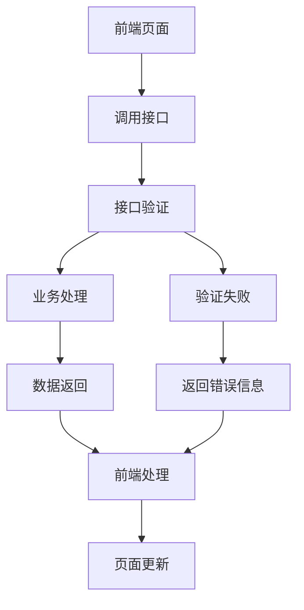

# 接口工程

## 1. 工程概述

接口工程是商品模板化需求的重要组成部分，统一管理所有API接口文档，为前端页面和后台服务提供标准化的接口规范。该工程包含7个核心接口，支持产品信息获取、用户认证、数据提交等完整业务流程。

### 1.1 工程定位
- **工程类型**：API接口文档工程
- **服务对象**：前端开发、后端开发、测试团队
- **核心价值**：提供统一的接口规范和文档管理

### 1.2 工程特点
- **统一管理**：所有接口文档集中管理，便于维护和查找
- **标准化**：统一的接口文档格式和规范
- **完整性**：覆盖完整的业务流程所需接口
- **可维护性**：模块化的接口文档结构

## 2. 业务流程

### 2.1 接口调用流程


### 2.2 接口分类流程

#### 2.2.1 数据获取类接口
1. **商品信息获取接口**：获取产品详细信息和规格配置
2. **协议获取接口**：获取协议内容和承诺书
3. **合同获取接口**：获取合同模板和签约信息

#### 2.2.2 用户认证类接口
1. **单点登录接口**：用户身份验证和授权

#### 2.2.3 数据处理类接口
1. **证照识别接口**：身份证信息识别和验证

#### 2.2.4 业务提交类接口
1. **企业产品预约提交接口**：提交预约信息
2. **企业产品订购接口**：提交订购信息

## 3. 功能特点

### 3.1 接口管理功能
- **统一文档**：所有接口文档统一格式和结构
- **版本控制**：支持接口版本管理和更新记录
- **参数规范**：统一的请求参数和返回数据格式
- **错误处理**：标准化的错误码和错误信息

### 3.2 接口分类功能
- **按功能分类**：数据获取、用户认证、数据处理、业务提交
- **按模块分类**：预约模块接口、订购模块接口
- **按优先级分类**：核心接口、辅助接口

### 3.3 接口文档功能
- **详细说明**：接口名称、英文名称、调用地址、请求方式
- **参数说明**：请求参数、返回参数、参数类型、是否必填
- **示例代码**：请求示例、返回示例、错误示例
- **测试说明**：测试用例、测试数据、测试环境

## 4. 接口列表

### 4.1 核心接口概览

| 接口名称 | 英文名称 | 调用地址 | 请求方式 | 功能描述 |
|---------|---------|---------|---------|---------|
| 商品信息获取接口 | Get Product Information | `/api/product/getProductInfo` | GET/POST | 获取智慧酒店包产品的详细信息 |
| 单点登录接口 | Single Sign-On | `/api/auth/sso` | POST | 用户身份验证和授权 |
| 协议获取接口 | Get Agreement | `/api/agreement/getAgreement` | GET/POST | 获取协议内容和承诺书 |
| 证照识别接口 | ID Card Recognition | `/api/ocr/idCardRecognition` | POST | 身份证信息识别和验证 |
| 合同获取接口 | Get Contract | `/api/contract/getContract` | GET/POST | 获取合同模板和签约信息 |
| 企业产品预约提交接口 | Submit Product Reservation | `/api/reservation/submitReservation` | POST | 提交预约信息 |
| 企业产品订购接口 | Submit Product Order | `/api/order/submitOrder` | POST | 提交订购信息 |

### 4.2 接口分类详情

#### 4.2.1 数据获取类接口
- **商品信息获取接口**：[商品信息获取接口文档](./商品信息获取接口.md)
- **协议获取接口**：[协议获取接口文档](./协议获取接口.md)
- **合同获取接口**：[合同获取接口文档](./合同获取接口.md)

#### 4.2.2 用户认证类接口
- **单点登录接口**：[单点登录接口文档](./单点登录接口.md)

#### 4.2.3 数据处理类接口
- **证照识别接口**：[证照识别接口文档](./证照识别接口.md)

#### 4.2.4 业务提交类接口
- **企业产品预约提交接口**：[企业产品预约提交接口文档](./企业产品预约提交接口.md)
- **企业产品订购接口**：[企业产品订购接口文档](./企业产品订购接口.md)

## 5. 接口规范

### 5.1 通用规范
- **请求格式**：统一使用JSON格式
- **响应格式**：统一使用JSON格式
- **字符编码**：统一使用UTF-8编码
- **时间格式**：统一使用ISO 8601格式

### 5.2 请求规范
- **请求头**：Content-Type: application/json
- **认证方式**：Bearer Token或Session认证
- **参数验证**：所有参数必须进行格式和内容验证
- **错误处理**：统一的错误码和错误信息格式

### 5.3 响应规范
- **成功响应**：HTTP状态码200，返回业务数据
- **错误响应**：HTTP状态码4xx/5xx，返回错误信息
- **数据格式**：统一的响应数据结构
- **分页处理**：统一的分页参数和返回格式

## 6. 测试要求

### 6.1 测试用例文档
- **完整测试用例**：[智慧酒店包产品详情页测试用例](https://scn19pp095sm.feishu.cn/base/Y6CZbC4HWaotEds1azBcsW0hnAg?from=from_copylink)

### 6.2 测试分类概览

#### 6.2.1 功能测试
- **接口调用测试**：验证接口正常调用和返回
- **参数验证测试**：验证请求参数的格式和内容
- **业务逻辑测试**：验证接口的业务逻辑正确性
- **数据完整性测试**：验证返回数据的完整性

#### 6.2.2 性能测试
- **响应时间测试**：测试接口的响应时间
- **并发测试**：测试接口的并发处理能力
- **压力测试**：测试接口在高负载下的表现
- **稳定性测试**：测试接口的长期稳定性

#### 6.2.3 安全测试
- **认证测试**：验证接口的认证机制
- **授权测试**：验证接口的权限控制
- **数据安全测试**：验证数据传输的安全性
- **输入验证测试**：验证输入数据的安全性

#### 6.2.4 兼容性测试
- **版本兼容测试**：测试不同版本接口的兼容性
- **浏览器兼容测试**：测试不同浏览器的兼容性
- **设备兼容测试**：测试不同设备的兼容性

### 6.3 测试环境要求
- **测试服务器**：独立的测试环境服务器
- **测试数据**：完整的测试数据集
- **测试工具**：Postman、JMeter等接口测试工具
- **监控工具**：接口性能监控和日志分析工具

### 6.4 测试执行说明
- **测试用例覆盖**：详细测试用例请参考[测试用例文档](https://scn19pp095sm.feishu.cn/base/Y6CZbC4HWaotEds1azBcsW0hnAg?from=from_copylink)
- **测试优先级**：按接口重要性分为高、中、低三个优先级
- **测试执行顺序**：功能测试 → 性能测试 → 安全测试 → 兼容性测试
- **缺陷管理**：按严重程度分为严重、一般、轻微三个等级

## 7. 工程结构

### 7.1 目录结构
```
接口/
├── 接口工程.md
├── 商品信息获取接口.md
├── 单点登录接口.md
├── 协议获取接口.md
├── 证照识别接口.md
├── 合同获取接口.md
├── 企业产品预约提交接口.md
└── 企业产品订购接口.md
```

### 7.2 文档规范
- **命名规范**：接口名称.md
- **格式规范**：统一的Markdown格式
- **内容规范**：包含接口概述、参数说明、示例代码、测试要求、Mock数据
- **更新规范**：版本控制和更新记录

## 8. Mock数据支持

### 8.1 Mock数据特点
- **完整覆盖**：每个接口都提供完整的Mock数据
- **真实模拟**：Mock数据贴近真实业务场景
- **多种场景**：包含成功、失败、边界值等多种场景
- **即用即得**：可直接用于前端开发和测试

### 8.2 Mock数据内容
- **成功响应数据**：模拟接口正常调用返回的数据
- **错误响应数据**：模拟各种错误情况的返回数据
- **请求参数数据**：提供标准的请求参数示例
- **Mock服务配置**：提供Mock.js等工具的配置示例

### 8.3 使用方式
- **前端开发**：直接使用Mock数据进行页面开发
- **接口测试**：使用Mock数据验证接口调用逻辑
- **联调测试**：在后端接口未完成时使用Mock数据
- **演示展示**：使用Mock数据进行功能演示

## 9. 使用说明

### 9.1 接口调用
1. **查看接口文档**：选择对应的接口文档查看详细信息
2. **准备请求参数**：根据文档准备请求参数
3. **发送请求**：使用HTTP客户端发送请求
4. **处理响应**：根据响应格式处理返回数据

### 9.2 接口测试
1. **准备测试环境**：搭建测试环境和准备测试数据
2. **执行测试用例**：按照测试用例执行接口测试
3. **记录测试结果**：记录测试结果和发现的问题
4. **问题跟踪**：跟踪和解决测试中发现的问题

### 9.3 Mock数据使用
- **开发阶段**：使用Mock数据进行前端开发和接口联调
- **测试阶段**：使用Mock数据进行接口测试和功能验证
- **演示阶段**：使用Mock数据进行功能演示和用户培训

### 9.4 接口维护
1. **版本管理**：管理接口版本和更新记录
2. **文档更新**：及时更新接口文档
3. **兼容性维护**：维护接口的向后兼容性
4. **性能优化**：持续优化接口性能

## 9. 更新记录

### 版本1.0.0 (2024-12-20)
- 创建接口工程初始版本
- 建立统一的接口文档结构
- 整理所有接口文档
- 制定接口规范和测试要求

## 10. 相关文档

- [需求01-商品模板化需求](../需求01-商品模板化需求.md)
- [模块01-企业产品预约模块](../模块01-企业产品预约模块/企业产品预约模块.md)
- [模块02-企业产品订购模块](../模块02-企业产品订购模块/企业产品订购模块.md)

## 11. 联系方式

如有问题或建议，请联系开发团队。
