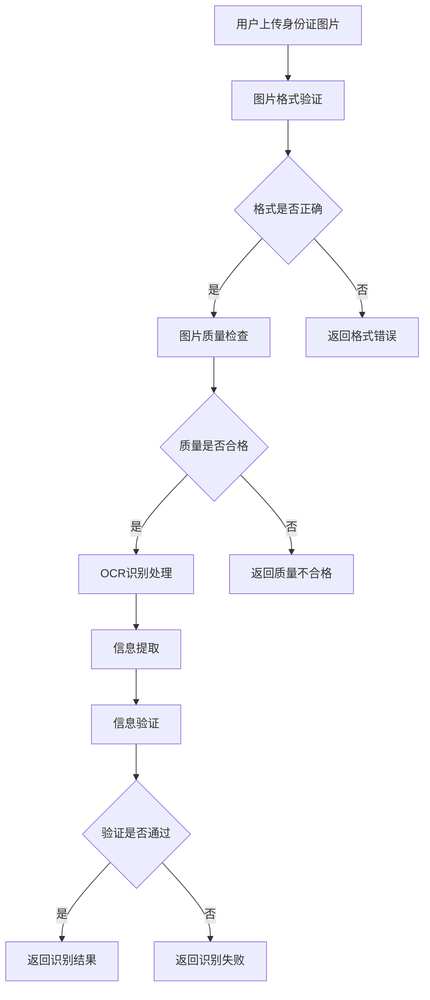

# 证照识别接口

## 1. 接口概述

证照识别接口是企业产品订购模块的身份证识别接口，基于OCR技术自动识别身份证信息，提供身份证正反面信息的自动提取和验证服务。

### 1.1 接口定位
- **接口类型**：数据处理类接口
- **服务对象**：身份证上传页面
- **核心价值**：提供高效的身份证信息识别和验证服务

### 1.2 接口特点
- **OCR识别**：基于先进的OCR技术进行身份证识别
- **高精度**：高精度的身份证信息提取
- **快速响应**：优化的识别算法和响应速度
- **安全可靠**：安全的图片传输和数据处理

## 2. 业务流程

### 2.1 识别流程


## 3. 功能特点

### 3.1 识别功能
- **正面识别**：识别身份证正面信息
- **反面识别**：识别身份证反面信息
- **信息提取**：提取姓名、身份证号、地址等信息
- **格式验证**：验证身份证号码格式

### 3.2 验证功能
- **信息完整性验证**：验证识别信息的完整性
- **格式正确性验证**：验证身份证号码格式
- **逻辑一致性验证**：验证信息的逻辑一致性
- **重复性检查**：检查身份证是否已存在

## 4. API接口

### 4.1 接口基本信息
- **接口名称**：证照识别接口
- **英文名称**：ID Card Recognition
- **调用地址**：`/api/ocr/idCardRecognition`
- **请求方式**：POST
- **接口版本**：v1.0
- **接口状态**：已发布

### 4.2 请求参数

#### 4.2.1 请求头参数
| 参数名 | 类型 | 必填 | 说明 |
|--------|------|------|------|
| Content-Type | String | 是 | multipart/form-data |
| Authorization | String | 是 | Bearer Token |

#### 4.2.2 请求体参数
| 参数名 | 类型 | 必填 | 说明 | 示例值 |
|--------|------|------|------|--------|
| image | File | 是 | 身份证图片文件 | - |
| cardType | String | 是 | 身份证类型 | "front" 或 "back" |
| userId | String | 否 | 用户ID | "USER_001" |

### 4.3 响应参数

#### 4.3.1 成功响应
```json
{
  "code": 200,
  "message": "识别成功",
  "data": {
    "cardType": "front",
    "recognitionResult": {
      "name": "张三",
      "idNumber": "110101199001011234",
      "gender": "男",
      "nation": "汉",
      "birthDate": "1990-01-01",
      "address": "北京市东城区某某街道某某号",
      "issuingAuthority": "某某公安局",
      "validPeriod": "2020.01.01-2030.01.01"
    },
    "confidence": 0.95,
    "processTime": 1.2
  }
}
```

#### 4.3.2 错误响应
```json
{
  "code": 400,
  "message": "识别失败",
  "data": null,
  "errors": [
    {
      "field": "image",
      "message": "图片格式不支持"
    }
  ]
}
```

## 5. 测试要求

### 5.1 测试用例文档
- **完整测试用例**：[智慧酒店包产品详情页测试用例](https://scn19pp095sm.feishu.cn/base/Y6CZbC4HWaotEds1azBcsW0hnAg?from=from_copylink)

### 5.2 测试分类概览

#### 5.2.1 功能测试
- **正面识别测试**：验证身份证正面识别功能
- **反面识别测试**：验证身份证反面识别功能
- **图片格式测试**：验证不同图片格式的支持
- **识别精度测试**：验证识别结果的准确性

#### 5.2.2 性能测试
- **识别速度测试**：测试识别处理速度
- **并发测试**：测试并发识别处理能力
- **大文件测试**：测试大尺寸图片的处理
- **内存使用测试**：测试内存使用情况

#### 5.2.3 安全测试
- **图片安全测试**：验证图片传输的安全性
- **数据保护测试**：验证识别数据的安全保护
- **权限控制测试**：验证接口访问权限控制
- **恶意文件测试**：测试恶意文件的安全处理

## 6. 使用说明

### 6.1 接口调用示例

#### 6.1.1 JavaScript调用示例
```javascript
// 身份证识别
async function recognizeIdCard(imageFile, cardType) {
  try {
    const formData = new FormData();
    formData.append('image', imageFile);
    formData.append('cardType', cardType);
    formData.append('userId', getCurrentUserId());
    
    const response = await fetch('/api/ocr/idCardRecognition', {
      method: 'POST',
      headers: {
        'Authorization': 'Bearer ' + getAccessToken()
      },
      body: formData
    });
    
    const result = await response.json();
    if (result.code === 200) {
      return result.data;
    } else {
      throw new Error(result.message);
    }
  } catch (error) {
    console.error('身份证识别失败:', error);
    throw error;
  }
}
```

### 6.2 注意事项
- 确保图片格式为JPG、PNG等常见格式
- 图片大小建议不超过5MB
- 确保图片清晰度足够进行识别
- 注意保护用户隐私信息

## 7. Mock数据

### 7.1 成功响应Mock数据
```json
{
  "code": 200,
  "message": "识别成功",
  "data": {
    "cardType": "front",
    "recognitionResult": {
      "name": "张三",
      "idNumber": "110101199001011234",
      "gender": "男",
      "nation": "汉",
      "birthDate": "1990-01-01",
      "address": "北京市东城区某某街道某某号",
      "issuingAuthority": "某某公安局",
      "validPeriod": "2020.01.01-2030.01.01"
    },
    "confidence": 0.95,
    "processTime": 1.2
  }
}
```

### 7.2 反面识别Mock数据
```json
{
  "code": 200,
  "message": "识别成功",
  "data": {
    "cardType": "back",
    "recognitionResult": {
      "issuingAuthority": "某某公安局",
      "validPeriod": "2020.01.01-2030.01.01"
    },
    "confidence": 0.92,
    "processTime": 1.1
  }
}
```

### 7.3 错误响应Mock数据
```json
{
  "code": 400,
  "message": "识别失败",
  "data": null,
  "errors": [
    {
      "field": "image",
      "message": "图片格式不支持"
    }
  ]
}
```

### 7.4 请求参数Mock数据
```javascript
// FormData 格式的请求参数
const formData = new FormData();
formData.append('image', file); // 身份证图片文件
formData.append('cardType', 'front'); // 或 'back'
formData.append('userId', 'USER_001');
```

### 7.5 Mock服务配置
```javascript
// Mock.js 配置示例
Mock.mock('/api/ocr/idCardRecognition', 'post', function(options) {
  const formData = new FormData();
  // 模拟解析FormData
  const cardType = 'front'; // 从请求中获取
  
  if (cardType === 'front') {
    return {
      code: 200,
      message: '识别成功',
      data: {
        cardType: 'front',
        recognitionResult: {
          name: '@cname',
          idNumber: '@id',
          gender: '@pick(["男", "女"])',
          nation: '@pick(["汉", "回", "满", "蒙", "藏"])',
          birthDate: '@date("yyyy-MM-dd")',
          address: '@county(true)@cword(2,4)街道@cword(2,4)号',
          issuingAuthority: '@county(true)公安局',
          validPeriod: '@date("yyyy.MM.dd")-@date("yyyy.MM.dd")'
        },
        confidence: '@float(0.8, 0.99, 2, 2)',
        processTime: '@float(0.5, 2.0, 1, 1)'
      }
    };
  } else {
    return {
      code: 200,
      message: '识别成功',
      data: {
        cardType: 'back',
        recognitionResult: {
          issuingAuthority: '@county(true)公安局',
          validPeriod: '@date("yyyy.MM.dd")-@date("yyyy.MM.dd")'
        },
        confidence: '@float(0.8, 0.99, 2, 2)',
        processTime: '@float(0.5, 2.0, 1, 1)'
      }
    };
  }
});
```

## 8. 更新记录

### 版本1.0.0 (2024-12-20)
- 创建接口初始版本
- 定义接口基本规范和参数
- 完善接口文档和测试用例
- 增加Mock数据支持

## 9. 相关文档

- [接口工程文档](./接口工程.md)
- [需求01-商品模板化需求](../需求01-商品模板化需求.md)
- [身份证上传页面](../模块02-企业产品订购模块/原型05-身份证上传页面/身份证上传页面.md)

## 9. 联系方式

如有问题或建议，请联系开发团队。
