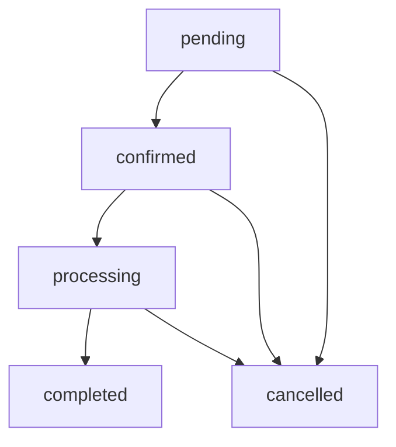

# 个人预约订单表 (t_gr_reservation_order)

## 1. 表概述

个人预约订单表是智慧酒店包商品模板化需求的核心业务表，存储个人用户的产品预约订单信息，包括用户信息、产品信息、预约详情、订单状态等，为预约流程管理、订单跟踪、客户服务等业务功能提供数据支持。

### 1.1 表定位
- **表类型**：核心业务表
- **主要用途**：存储个人预约订单信息
- **业务模块**：预约管理、订单管理、客户服务
- **数据特点**：业务数据，更新频率高

### 1.2 表特点
- **业务完整**：包含完整的预约订单信息
- **状态管理**：支持订单状态流转
- **关联紧密**：与用户表和产品表紧密关联
- **扩展性好**：支持预约信息的扩展

## 2. 表结构

### 2.1 字段定义

| 字段名 | 数据类型 | 长度 | 是否为空 | 默认值 | 说明 |
|--------|----------|------|----------|--------|------|
| order_id | VARCHAR | 50 | NOT NULL | - | 订单ID，主键 |
| user_id | VARCHAR | 50 | NOT NULL | - | 用户ID |
| product_id | VARCHAR | 50 | NOT NULL | - | 产品ID |
| order_status | VARCHAR | 20 | NOT NULL | 'pending' | 订单状态 |
| reservation_info | JSON | - | NOT NULL | - | 预约信息 |
| customer_info | JSON | - | NOT NULL | - | 客户信息 |
| address_info | JSON | - | NOT NULL | - | 地址信息 |
| product_config | JSON | - | NOT NULL | - | 产品配置 |
| total_amount | DECIMAL | 10,2 | NOT NULL | 0.00 | 订单总金额 |
| remark | TEXT | - | NULL | NULL | 备注信息 |
| create_time | DATETIME | - | NOT NULL | CURRENT_TIMESTAMP | 创建时间 |
| update_time | DATETIME | - | NOT NULL | CURRENT_TIMESTAMP | 更新时间 |
| create_user | VARCHAR | 50 | NULL | NULL | 创建用户 |
| update_user | VARCHAR | 50 | NULL | NULL | 更新用户 |

### 2.2 字段详细说明

#### 2.2.1 主键字段
- **order_id**：订单唯一标识，格式为"RES_YYYYMMDD_序号"
- 示例：RES_20241220_001

#### 2.2.2 关联字段
- **user_id**：用户ID，关联用户表
- **product_id**：产品ID，关联产品表

#### 2.2.3 业务字段
- **order_status**：订单状态，可选值：pending(待处理)、confirmed(已确认)、processing(处理中)、completed(已完成)、cancelled(已取消)
- **total_amount**：订单总金额
- **remark**：备注信息

#### 2.2.4 JSON字段
- **reservation_info**：预约信息，JSON格式
- **customer_info**：客户信息，JSON格式
- **address_info**：地址信息，JSON格式
- **product_config**：产品配置，JSON格式

#### 2.2.5 系统字段
- **create_time**：记录创建时间
- **update_time**：记录最后更新时间
- **create_user**：创建用户ID
- **update_user**：最后更新用户ID

## 3. JSON字段结构

### 3.1 reservation_info 结构
```json
{
  "reservation_type": "product_reservation",
  "reservation_date": "2024-12-25",
  "reservation_time": "14:00",
  "contact_method": "phone",
  "special_requirements": "需要提前联系"
}
```

### 3.2 customer_info 结构
```json
{
  "customer_name": "张三",
  "customer_phone": "13800138000",
  "customer_email": "zhangsan@example.com",
  "customer_type": "individual",
  "id_number": "110101199001011234"
}
```

### 3.3 address_info 结构
```json
{
  "city": "广州市",
  "district": "天河区",
  "install_address": "测试楼宇",
  "building": "6栋",
  "room": "601",
  "postal_code": "510000",
  "contact_person": "张三",
  "contact_phone": "13800138000"
}
```

### 3.4 product_config 结构
```json
{
  "product_id": "PROD_20241220_001",
  "product_name": "智慧酒店包",
  "packet_type": "month",
  "price": 40,
  "bandwidth": "100M",
  "tv": "商务电视IPTV",
  "screen": "屏幕定制标准版",
  "quantity": 1,
  "unit_price": 40.00
}
```

## 4. 索引设计

### 4.1 主键索引
```sql
PRIMARY KEY (order_id)
```

### 4.2 普通索引
```sql
-- 用户ID索引
CREATE INDEX idx_user_id ON t_gr_reservation_order(user_id);

-- 产品ID索引
CREATE INDEX idx_product_id ON t_gr_reservation_order(product_id);

-- 订单状态索引
CREATE INDEX idx_order_status ON t_gr_reservation_order(order_status);

-- 创建时间索引
CREATE INDEX idx_create_time ON t_gr_reservation_order(create_time);

-- 更新时间索引
CREATE INDEX idx_update_time ON t_gr_reservation_order(update_time);
```

### 4.3 复合索引
```sql
-- 用户和状态复合索引
CREATE INDEX idx_user_status ON t_gr_reservation_order(user_id, order_status);

-- 产品和状态复合索引
CREATE INDEX idx_product_status ON t_gr_reservation_order(product_id, order_status);

-- 状态和时间复合索引
CREATE INDEX idx_status_time ON t_gr_reservation_order(order_status, create_time);
```

## 5. 约束条件

### 5.1 主键约束
- **order_id**：主键，唯一且非空

### 5.2 外键约束
```sql
-- 关联用户表
ALTER TABLE t_gr_reservation_order 
ADD CONSTRAINT fk_reservation_user_id 
FOREIGN KEY (user_id) REFERENCES t_user_info(user_id);

-- 关联产品表
ALTER TABLE t_gr_reservation_order 
ADD CONSTRAINT fk_reservation_product_id 
FOREIGN KEY (product_id) REFERENCES t_iqimall_product(product_id);
```

### 5.3 检查约束
```sql
-- 订单状态约束
ALTER TABLE t_gr_reservation_order 
ADD CONSTRAINT chk_order_status 
CHECK (order_status IN ('pending', 'confirmed', 'processing', 'completed', 'cancelled'));

-- 订单金额约束
ALTER TABLE t_gr_reservation_order 
ADD CONSTRAINT chk_total_amount 
CHECK (total_amount >= 0);
```

## 6. 示例数据

### 6.1 测试数据
```sql
INSERT INTO t_gr_reservation_order (
    order_id, user_id, product_id, order_status,
    reservation_info, customer_info, address_info, product_config,
    total_amount, remark, create_time, update_time, create_user, update_user
) VALUES 
(
    'RES_20241220_001', 'USER_001', 'PROD_20241220_001', 'pending',
    '{"reservation_type": "product_reservation", "reservation_date": "2024-12-25", "reservation_time": "14:00", "contact_method": "phone", "special_requirements": "需要提前联系"}',
    '{"customer_name": "张三", "customer_phone": "13800138000", "customer_email": "zhangsan@example.com", "customer_type": "individual", "id_number": "110101199001011234"}',
    '{"city": "广州市", "district": "天河区", "install_address": "测试楼宇", "building": "6栋", "room": "601", "postal_code": "510000", "contact_person": "张三", "contact_phone": "13800138000"}',
    '{"product_id": "PROD_20241220_001", "product_name": "智慧酒店包", "packet_type": "month", "price": 40, "bandwidth": "100M", "tv": "商务电视IPTV", "screen": "屏幕定制标准版", "quantity": 1, "unit_price": 40.00}',
    40.00, '测试预约订单', '2024-12-20 10:00:00', '2024-12-20 10:00:00',
    'USER_001', 'USER_001'
);
```

### 6.2 查询示例
```sql
-- 查询用户的所有预约订单
SELECT 
    order_id, product_id, order_status, total_amount, create_time
FROM t_gr_reservation_order 
WHERE user_id = 'USER_001' 
ORDER BY create_time DESC;

-- 查询指定状态的订单
SELECT 
    order_id, user_id, product_id, total_amount, create_time
FROM t_gr_reservation_order 
WHERE order_status = 'pending' 
ORDER BY create_time ASC;

-- 查询订单详细信息
SELECT 
    o.order_id,
    o.order_status,
    o.total_amount,
    JSON_EXTRACT(o.customer_info, '$.customer_name') as customer_name,
    JSON_EXTRACT(o.customer_info, '$.customer_phone') as customer_phone,
    JSON_EXTRACT(o.address_info, '$.install_address') as install_address,
    JSON_EXTRACT(o.product_config, '$.product_name') as product_name
FROM t_gr_reservation_order o
WHERE o.order_id = 'RES_20241220_001';
```

## 7. 数据关系

### 7.1 关联表
- **t_user_info**：通过user_id关联用户表
- **t_iqimall_product**：通过product_id关联产品表

### 7.2 关系说明
- 一个用户可以有多个预约订单
- 一个产品可以对应多个预约订单
- 订单记录依赖用户和产品记录存在

## 8. 业务规则

### 8.1 数据规则
- 订单ID必须唯一
- 用户ID和产品ID必须存在对应记录
- 订单状态必须符合预定义值
- 订单金额必须大于等于0

### 8.2 业务规则
- 只有激活状态的产品才能被预约
- 用户必须登录才能创建预约订单
- 订单状态变更需要记录变更历史
- 取消订单需要检查业务规则

## 9. 状态流转

### 9.1 状态定义
- **pending**：待处理，订单刚创建
- **confirmed**：已确认，订单已确认
- **processing**：处理中，订单正在处理
- **completed**：已完成，订单处理完成
- **cancelled**：已取消，订单已取消

### 9.2 流转规则


## 10. 性能优化

### 10.1 查询优化
- 使用用户ID索引进行用户订单查询
- 使用产品ID索引进行产品订单查询
- 使用状态索引进行状态筛选
- 使用复合索引进行多条件查询

### 10.2 存储优化
- JSON字段使用合适的存储引擎
- 定期清理历史订单数据
- 考虑订单数据的分区存储

## 11. 数据维护

### 11.1 数据清理
- 定期清理已取消的订单
- 清理过期的预约信息
- 清理无效的客户信息

### 11.2 数据备份
- 定期备份订单数据
- 备份订单状态变更历史
- 备份订单关联信息

## 12. 安全考虑

### 12.1 数据安全
- 客户信息需要加密存储
- 订单信息需要权限控制
- 敏感信息需要脱敏处理

### 12.2 访问控制
- 订单查询需要用户身份验证
- 订单管理需要管理员权限
- 订单修改需要审核流程

## 13. 更新记录

### 版本1.0.0 (2024-12-20)
- 创建表结构初始版本
- 定义JSON字段结构
- 建立约束条件
- 完善示例数据和查询

## 14. 相关文档

- [数据库表工程](./数据库表工程.md)
- [省级产品信息表](./t_iqimall_product.md)
- [用户信息表](./t_user_info.md)
- [企业订购订单表](./t_enterprise_order.md)

## 15. 联系方式

如有问题或建议，请联系开发团队。
