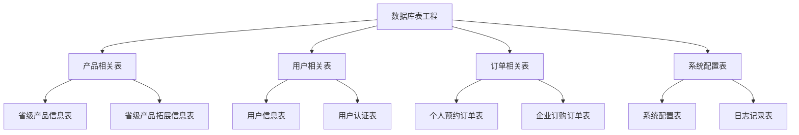
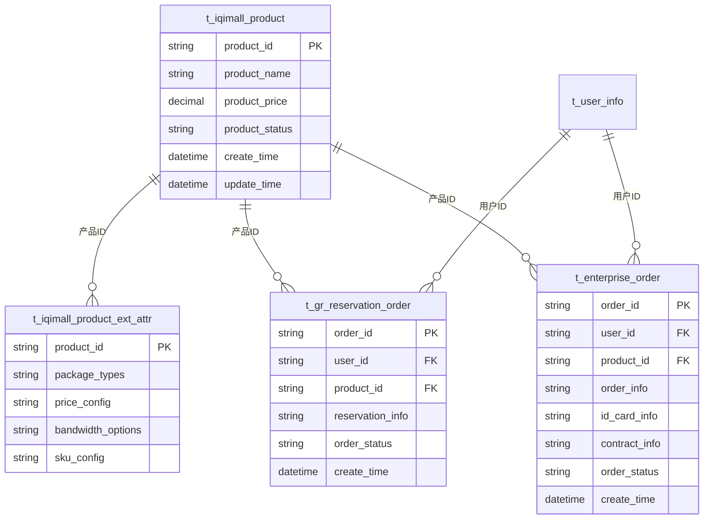

# 数据库表工程

## 1. 工程概述

数据库表工程是智慧酒店包商品模板化需求的数据存储层文档集合，包含所有业务相关的数据库表结构、字段定义、索引配置、数据关系等详细信息，为系统开发和维护提供完整的数据模型支持。

### 1.1 工程定位
- **工程类型**：数据存储层文档工程
- **服务对象**：后端开发、数据库设计、系统维护
- **核心价值**：提供完整的数据模型和表结构规范

### 1.2 工程特点
- **结构完整**：包含所有业务相关的数据库表
- **文档详细**：详细的字段定义、约束、索引信息
- **关系清晰**：明确的数据表关系和依赖关系
- **规范统一**：统一的命名规范和设计标准

## 2. 数据库架构

### 2.1 整体架构


### 2.2 表关系图


## 3. 数据库表分类

### 3.1 产品相关表
- **省级产品信息表**：[t_iqimall_product](./t_iqimall_product.md)
- **省级产品拓展信息表**：[t_iqimall_product_ext_attr](./t_iqimall_product_ext_attr.md)

### 3.2 用户相关表
- **用户信息表**：[t_user_info](./t_user_info.md)
- **用户认证表**：[t_user_auth](./t_user_auth.md)

### 3.3 订单相关表
- **个人预约订单表**：[t_gr_reservation_order](./t_gr_reservation_order.md)
- **企业订购订单表**：[t_enterprise_order](./t_enterprise_order.md)

### 3.4 系统配置表
- **系统配置表**：[t_system_config](./t_system_config.md)
- **操作日志表**：[t_operation_log](./t_operation_log.md)

## 4. 表结构概览

| 表名 | 中文名称 | 主要用途 | 记录数量级 | 更新频率 |
|------|----------|----------|------------|----------|
| t_iqimall_product | 省级产品信息表 | 存储产品基本信息 | 100+ | 低 |
| t_iqimall_product_ext_attr | 省级产品拓展信息表 | 存储产品扩展属性 | 100+ | 低 |
| t_user_info | 用户信息表 | 存储用户基本信息 | 10万+ | 中 |
| t_user_auth | 用户认证表 | 存储用户认证信息 | 10万+ | 中 |
| t_gr_reservation_order | 个人预约订单表 | 存储预约订单信息 | 1万+ | 高 |
| t_enterprise_order | 企业订购订单表 | 存储订购订单信息 | 1万+ | 高 |
| t_system_config | 系统配置表 | 存储系统配置信息 | 100+ | 低 |
| t_operation_log | 操作日志表 | 存储操作日志信息 | 100万+ | 高 |

## 5. 设计规范

### 5.1 命名规范
- **表名规范**：t_模块_功能_类型
- **字段名规范**：下划线分隔的小写字母
- **索引名规范**：idx_表名_字段名
- **约束名规范**：fk_表名_字段名

### 5.2 字段规范
- **主键字段**：统一使用字符串类型，格式为"类型_时间戳_序号"
- **时间字段**：统一使用datetime类型，格式为"YYYY-MM-DD HH:mm:ss"
- **状态字段**：统一使用字符串类型，定义明确的状态值
- **金额字段**：统一使用decimal(10,2)类型

### 5.3 索引规范
- **主键索引**：每个表必须有主键索引
- **唯一索引**：业务唯一字段建立唯一索引
- **普通索引**：查询频繁字段建立普通索引
- **复合索引**：多字段查询建立复合索引

## 6. 数据安全

### 6.1 数据保护
- **敏感数据加密**：身份证号、手机号等敏感信息加密存储
- **访问权限控制**：基于角色的数据库访问权限控制
- **数据备份策略**：定期数据备份和恢复测试
- **审计日志记录**：所有数据操作记录审计日志

### 6.2 数据合规
- **个人信息保护**：符合个人信息保护相关法规
- **数据存储期限**：按照业务需求设定数据存储期限
- **数据删除机制**：提供安全的数据删除机制
- **数据导出控制**：控制敏感数据的导出和访问

## 7. 性能优化

### 7.1 查询优化
- **索引优化**：根据查询模式优化索引设计
- **分页查询**：大数据量查询使用分页机制
- **查询缓存**：热点数据使用查询缓存
- **慢查询监控**：监控和优化慢查询

### 7.2 存储优化
- **数据分区**：大表按时间或业务维度分区
- **数据归档**：历史数据定期归档
- **存储引擎**：根据业务特点选择合适的存储引擎
- **压缩存储**：对历史数据进行压缩存储

## 8. 工程结构

### 8.1 目录结构
```
数据库表/
├── 数据库表工程.md
├── t_iqimall_product.md
├── t_iqimall_product_ext_attr.md
├── t_user_info.md
├── t_user_auth.md
├── t_gr_reservation_order.md
├── t_enterprise_order.md
├── t_system_config.md
└── t_operation_log.md
```

### 8.2 文档规范
- **命名规范**：表名.md
- **格式规范**：统一的Markdown格式
- **内容规范**：包含表结构、字段定义、索引、约束、示例数据
- **更新规范**：版本控制和更新记录

## 9. 使用说明

### 9.1 表结构查询
1. **查看表文档**：选择对应的表文档查看详细信息
2. **了解字段定义**：查看字段类型、长度、约束等信息
3. **查看索引配置**：了解表的索引设计和性能优化
4. **查看数据关系**：了解表之间的关联关系

### 9.2 开发集成
- **后端开发**：按照表结构设计数据访问层
- **数据库设计**：根据表结构创建数据库表
- **数据迁移**：使用表结构进行数据迁移
- **性能优化**：根据索引设计优化查询性能

### 9.3 维护管理
- **结构变更**：记录表结构的变更历史
- **数据维护**：定期维护和清理数据
- **性能监控**：监控表的使用情况和性能
- **备份恢复**：制定数据备份和恢复策略

## 10. 更新记录

### 版本1.0.0 (2024-12-20)
- 创建数据库表工程初始版本
- 定义表结构规范和设计标准
- 建立完整的表文档体系
- 完善数据安全和性能优化规范

## 11. 相关文档

- [需求01-商品模板化需求](../需求01-商品模板化需求.md)
- [接口工程](../接口/接口工程.md)
- [企业产品预约模块](../模块01-企业产品预约模块/企业产品预约模块.md)
- [企业产品订购模块](../模块02-企业产品订购模块/企业产品订购模块.md)

## 12. 联系方式

如有问题或建议，请联系开发团队。
