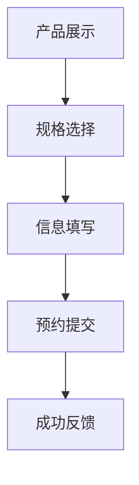

# 企业产品预约模块

## 1. 模块概述

企业产品预约模块是商品模板化需求的核心模块之一，主要用于企业用户对智慧酒店包等产品的预约服务。该模块提供完整的产品展示、规格选择、信息填写和预约提交流程，支持移动端和桌面端的用户交互体验。

### 1.1 模块定位
- **业务模式**：预约模式，适用于初步意向收集和需求调研
- **目标用户**：企业客户、潜在客户
- **核心价值**：快速收集用户产品需求和基本信息

### 1.2 模块特点
- **流程简化**：相比订购模式，流程更加简化
- **快速响应**：重点收集用户基本信息和产品需求
- **移动优先**：专为移动端设计的响应式界面

## 2. 业务流程

### 2.1 主要业务流程


### 2.2 详细操作流程

#### 2.2.1 产品浏览流程
1. **页面加载**：用户访问智慧酒店包产品详情页
2. **信息展示**：系统展示产品基本信息、价格、图片
3. **Tab切换**：用户可在"商品"和"详情"Tab间切换
4. **滚动浏览**：用户滚动查看完整产品信息

#### 2.2.2 规格选择流程
1. **触发选择**：用户点击"已选"或"立即预约"按钮
2. **弹窗打开**：系统打开规格选择弹窗(iframe)
3. **套餐选择**：用户选择月包或年包
4. **价格选择**：用户选择价格档位(40/50/80/100/120元)
5. **带宽选择**：系统根据价格自动筛选可用带宽选项
6. **确认选择**：用户确认规格配置
7. **数据同步**：弹窗通过消息机制同步数据到主页面
8. **页面更新**：主页面更新显示选择结果

#### 2.2.3 信息填写流程
1. **进入页面**：用户进入信息填写页面
2. **地址选择**：选择安装地址（城市、楼宇）
3. **详细地址**：填写详细地址（楼栋、房间号）
4. **联系方式**：填写姓名和联系电话
5. **备注信息**：填写备注信息（可选）
6. **信息确认**：确认产品信息
7. **提交预约**：点击提交预约按钮

#### 2.2.4 预约提交流程
1. **信息验证**：验证表单信息完整性
2. **数据提交**：提交预约信息到服务器
3. **状态展示**：显示预约成功状态
4. **后续操作**：提供后续操作选项

## 3. 功能特点

### 3.1 产品展示功能
- **产品详情展示**：完整的智慧酒店包产品信息展示
- **图片轮播**：支持产品banner图片和详情图片展示
- **价格展示**：实时显示产品价格和套餐类型
- **规格预览**：展示产品规格和配置信息
- **分享功能**：支持二维码分享和推广文案链接复制

### 3.2 规格选择功能
- **套餐类型选择**：支持月包和年包选择
- **价格档位**：提供多种价格选项（40/50/80/100/120元等）
- **带宽选择**：支持100M-1000M带宽选项
- **智能联动**：价格与带宽选项的智能联动机制
- **状态同步**：弹窗选择结果实时同步到主页面

### 3.3 信息收集功能
- **安装地址**：城市选择和具体楼宇选择
- **详细地址**：楼栋和房间号的分段输入
- **联系方式**：姓名和电话号码的并行输入
- **备注信息**：可选的备注说明输入
- **表单验证**：完整的表单验证机制

### 3.4 预约提交功能
- **信息验证**：完整的表单验证机制
- **预约提交**：支持预约信息的提交和确认
- **状态反馈**：预约成功后的状态展示
- **流程管理**：完整的预约流程控制

## 4. API接口

### 4.1 商品信息获取接口
- **接口名称**：商品信息获取接口
- **英文名称**：Get Product Information
- **调用地址**：`/api/product/getProductInfo`
- **请求方式**：GET/POST
- **功能描述**：获取智慧酒店包产品的详细信息
- **返回数据**：产品基本信息、价格配置、规格选项等

### 4.2 地图信息获取接口
- **接口名称**：地图信息获取接口
- **英文名称**：Get Map Information
- **调用地址**：`/api/map/getMapInfo`
- **请求方式**：GET/POST
- **功能描述**：获取地址建议和楼宇信息
- **返回数据**：地址建议、楼宇信息等

### 4.3 用户信息获取接口
- **接口名称**：用户信息获取接口
- **英文名称**：Get User Information
- **调用地址**：`/api/user/getUserInfo`
- **请求方式**：GET/POST
- **功能描述**：获取用户基本信息
- **返回数据**：用户基本信息、联系方式等

### 4.4 企业产品预约提交接口
- **接口名称**：企业产品预约提交接口
- **英文名称**：Submit Product Reservation
- **调用地址**：`/api/reservation/submitReservation`
- **请求方式**：POST
- **功能描述**：提交预约信息
- **返回数据**：预约结果、预约单号、状态信息

## 5. 关联的数据库表

### 5.1 省级产品信息表
- **表名称**：t_iqimall_product
- **主要字段**：产品ID、产品名称、价格、状态、创建时间等
- **用途**：存储智慧酒店包产品的基本信息

### 5.2 省级产品拓展信息表
- **表名称**：t_iqimall_product_ext_attr
- **主要字段**：产品ID、规格配置、套餐类型、带宽选项等
- **用途**：存储产品的扩展属性和规格配置信息

### 5.3 个人预约订单表
- **表名称**：t_gr_reservation_order
- **主要字段**：订单ID、用户ID、产品ID、预约信息、订单状态等
- **用途**：存储预约订单信息

### 5.4 数据关联关系
- 通过产品ID关联产品主表和扩展表
- 订单表关联用户信息和产品信息
- 支持多规格、多套餐类型的产品配置

## 6. 测试要求

### 6.1 测试用例文档
- **完整测试用例**：[智慧酒店包产品详情页测试用例](https://scn19pp095sm.feishu.cn/base/Y6CZbC4HWaotEds1azBcsW0hnAg?from=from_copylink)

### 6.2 测试分类概览

#### 6.2.1 功能测试
- **页面加载测试**：验证页面正常加载和渲染
- **规格选择测试**：验证套餐类型、价格、带宽选择功能
- **联动逻辑测试**：验证价格与带宽的联动关系
- **弹窗交互测试**：验证规格选择弹窗的打开、关闭、数据同步
- **分享功能测试**：验证二维码分享和链接复制功能
- **Tab切换测试**：验证商品和详情Tab的切换功能

#### 6.2.2 兼容性测试
- **移动端适配**：在不同尺寸的移动设备上测试
- **浏览器兼容**：在主流移动浏览器中测试
- **操作系统兼容**：在iOS和Android系统中测试
- **网络环境测试**：在不同网络环境下测试页面加载

#### 6.2.3 性能测试
- **页面加载速度**：测试页面首次加载时间
- **图片加载优化**：验证图片懒加载和压缩效果
- **内存使用**：测试长时间使用后的内存占用
- **弹窗性能**：测试弹窗打开关闭的响应速度

#### 6.2.4 用户体验测试
- **操作流程测试**：验证完整的用户操作流程
- **错误处理测试**：测试各种异常情况的处理
- **视觉设计测试**：验证UI设计的视觉效果
- **交互反馈测试**：验证用户操作的反馈效果

#### 6.2.5 接口测试
- **接口调用测试**：验证商品信息获取接口的正常调用
- **数据解析测试**：验证接口返回数据的正确解析
- **异常处理测试**：测试接口异常情况的处理
- **数据同步测试**：验证弹窗与主页面的数据同步

#### 6.2.6 安全测试
- **XSS防护测试**：验证输入数据的安全性
- **CSRF防护测试**：验证跨站请求伪造防护
- **数据验证测试**：验证前端数据验证的完整性
- **权限控制测试**：验证页面访问权限控制

### 6.3 测试环境要求
- **测试设备**：多种移动设备（iPhone、Android手机、平板）
- **测试浏览器**：Safari、Chrome、微信内置浏览器等
- **测试网络**：WiFi、4G、5G等不同网络环境
- **测试数据**：准备完整的测试数据和异常数据

### 6.4 测试执行说明
- **测试用例覆盖**：详细测试用例请参考[测试用例文档](https://scn19pp095sm.feishu.cn/base/Y6CZbC4HWaotEds1azBcsW0hnAg?from=from_copylink)
- **测试优先级**：按功能重要性分为高、中、低三个优先级
- **测试执行顺序**：功能测试 → 兼容性测试 → 性能测试 → 用户体验测试 → 接口测试 → 安全测试
- **缺陷管理**：按严重程度分为严重、一般、轻微三个等级

## 7. 模块结构

### 7.1 原型页面组成
```
企业产品预约模块/
├── 原型01-智慧酒店包产品详情页/
│   ├── 智慧酒店包产品详情页.html
│   ├── 智慧酒店包产品详情页.md
│   ├── 接口/
│   │   └── 商品信息获取接口.md
│   └── 数据库表/
│       ├── 省级产品信息(t_iqimall_product).txt
│       └── 省级产品拓展信息(t_iqimall_product_ext_attr).txt
├── 原型02-智慧酒店包规格选择弹窗/
│   ├── 智慧酒店包规格选择弹窗.html
│   ├── 智慧酒店包规格选择弹窗.md
│   ├── 接口/
│   │   └── 商品信息获取接口.md
│   └── 数据库表/
│       ├── 省级产品信息(t_iqimall_product).txt
│       └── 省级产品拓展信息(t_iqimall_product_ext_attr).txt
├── 原型03-智慧酒店包信息填写页面/
│   ├── 智慧酒店包信息填写页面.html
│   ├── 智慧酒店包信息填写页面.md
│   ├── 接口/
│   │   ├── 商品信息获取接口.md
│   │   ├── 地图信息获取接口.md
│   │   └── 用户信息获取接口.md
│   └── 数据库表/
│       ├── 省级产品信息(t_iqimall_product).txt
│       └── 省级产品拓展信息(t_iqimall_product_ext_attr).txt
├── 原型04-智慧酒店包提交成功页面/
│   ├── 智慧酒店包提交成功弹窗.html
│   ├── 智慧酒店包提交成功页面.md
│   ├── 接口/
│   │   └── 企业产品预约提交接口.md
│   └── 数据库表/
│       ├── 个人预约订单表(t_gr_reservation_order).txt
│       ├── 省级产品信息(t_iqimall_product).txt
│       └── 省级产品拓展信息(t_iqimall_product_ext_attr).txt
└── 企业产品预约模块原型合集/
    ├── banner.jpg
    ├── info.png
    ├── 智慧酒店包产品详情页.html
    ├── 智慧酒店包信息填写页面.html
    ├── 智慧酒店包提交成功弹窗.html
    ├── 智慧酒店包规格选择弹窗.html
    └── 预约成功.png
```

## 业务流程

### 1. 产品浏览流程
1. 用户访问智慧酒店包产品详情页
2. 浏览产品信息和图片
3. 查看产品规格和价格
4. 点击"已选"或"立即预约"按钮

### 2. 规格选择流程
1. 打开规格选择弹窗
2. 选择套餐类型（月包/年包）
3. 选择价格档位
4. 选择带宽（根据价格自动筛选）
5. 确认电视和屏幕定制选项
6. 点击确认按钮

### 3. 信息填写流程
1. 进入信息填写页面
2. 填写安装地址（城市、楼宇）
3. 填写详细地址（楼栋、房间号）
4. 填写姓名和联系电话
5. 填写备注信息（可选）
6. 确认产品信息
7. 点击提交预约按钮

### 4. 预约提交流程
1. 验证表单信息完整性
2. 提交预约信息到服务器
3. 显示预约成功状态
4. 提供后续操作选项

## 技术架构

### 1. 前端技术
- **HTML5**：页面结构和语义化标签
- **CSS3**：样式设计和响应式布局
- **JavaScript**：交互逻辑和数据处理
- **移动端适配**：支持移动端和桌面端

### 2. 交互设计
- **弹窗系统**：规格选择和信息填写弹窗
- **消息通信**：页面间的数据传递机制
- **状态管理**：用户选择和页面状态管理
- **动画效果**：页面切换和交互动画

### 3. 数据流程
- **产品信息获取**：从服务器获取产品数据
- **规格配置管理**：SKU规格联动配置
- **表单数据处理**：用户输入数据的收集和验证
- **预约信息提交**：预约数据的提交和确认

## 接口设计

### 1. 商品信息获取接口
- **接口名称**：商品信息获取接口
- **请求方式**：GET/POST
- **请求参数**：产品ID
- **返回数据**：产品详细信息、规格配置、价格信息

### 2. 地图信息获取接口
- **接口名称**：地图信息获取接口
- **请求方式**：GET/POST
- **请求参数**：地址关键词
- **返回数据**：地址建议、楼宇信息等

### 3. 用户信息获取接口
- **接口名称**：用户信息获取接口
- **请求方式**：GET/POST
- **请求参数**：用户ID
- **返回数据**：用户基本信息、联系方式等

### 4. 企业产品预约提交接口
- **接口名称**：企业产品预约提交接口
- **请求方式**：POST
- **请求参数**：预约信息、用户信息、产品信息
- **返回数据**：预约结果、预约单号、状态信息

## 数据库表结构

### 1. 省级产品信息表(t_iqimall_product)
- **表用途**：存储产品基本信息
- **主要字段**：
  - product_id：产品ID
  - product_name：产品名称
  - product_price：产品价格
  - product_spec：产品规格
  - product_status：产品状态

### 2. 省级产品拓展信息表(t_iqimall_product_ext_attr)
- **表用途**：存储产品扩展属性
- **主要字段**：
  - product_id：产品ID
  - attr_type：属性类型
  - attr_value：属性值
  - attr_desc：属性描述

### 3. 个人预约订单表(t_gr_reservation_order)
- **表用途**：存储预约订单信息
- **主要字段**：
  - order_id：订单ID
  - user_id：用户ID
  - product_id：产品ID
  - reservation_info：预约信息
  - order_status：订单状态
  - create_time：创建时间

## 使用说明

### 1. 模块部署
- 确保所有HTML文件和相关资源正确部署
- 配置接口服务地址和数据库连接
- 设置移动端和桌面端的访问权限

### 2. 功能测试
- 测试产品信息展示功能
- 验证规格选择联动机制
- 检查表单验证和提交流程
- 确认预约成功状态展示

### 3. 注意事项
- 确保产品图片资源正确加载
- 验证SKU规格配置的准确性
- 检查接口调用的稳定性
- 测试移动端兼容性

## 更新记录

### 版本1.0.0 (2024-01-01)
- 初始版本发布
- 实现完整的产品预约流程
- 支持移动端和桌面端访问
- 集成所有核心功能模块

## 相关文档

- [智慧酒店包产品详情页](原型01-智慧酒店包产品详情页/智慧酒店包产品详情页.md)
- [智慧酒店包规格选择弹窗](原型02-智慧酒店包规格选择弹窗/智慧酒店包规格选择弹窗.md)
- [智慧酒店包信息填写页面](原型03-智慧酒店包信息填写页面/智慧酒店包信息填写页面.md)
- [智慧酒店包提交成功页面](原型04-智慧酒店包提交成功页面/智慧酒店包提交成功页面.md)

## 联系方式

如有问题或建议，请联系开发团队。

---

*本文档最后更新时间：2024-01-01*
