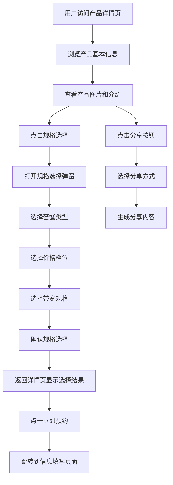

# 智慧酒店包产品详情页

## 1. 页面概述

智慧酒店包产品详情页是企业产品预约模块的核心页面，主要用于展示智慧酒店包产品的详细信息，支持产品规格选择、价格展示和用户预约功能。

### 页面定位
- **模块归属**：企业产品预约模块
- **页面类型**：产品展示与规格选择页面
- **用户角色**：企业客户、潜在客户
- **主要功能**：产品信息展示、规格配置、预约引导

### 核心价值
- 提供直观的产品信息展示
- 支持灵活的规格配置选择
- 引导用户完成预约流程
- 提升用户购买决策效率

## 2. 业务流程

### 2.1 主要业务流程

### 2.2 详细操作流程

#### 2.2.1 产品浏览流程
1. **页面加载**：用户访问产品详情页
2. **信息展示**：系统展示产品基本信息、价格、图片
3. **Tab切换**：用户可在"商品"和"详情"Tab间切换
4. **滚动浏览**：用户滚动查看完整产品信息

#### 2.2.2 规格选择流程
1. **触发选择**：用户点击"已选"或"立即预约"按钮
2. **弹窗打开**：系统打开规格选择弹窗(iframe)
3. **套餐选择**：用户选择月包或年包
4. **价格选择**：用户选择价格档位(40/50/80/100/120元)
5. **带宽选择**：系统根据价格自动筛选可用带宽选项
6. **确认选择**：用户确认规格配置
7. **数据同步**：弹窗通过消息机制同步数据到主页面
8. **页面更新**：主页面更新显示选择结果

#### 2.2.3 预约引导流程
1. **规格确认**：用户确认规格选择
2. **预约操作**：用户点击"立即预约"按钮
3. **页面跳转**：系统跳转到信息填写页面
4. **流程继续**：进入后续预约流程

### 2.3 异常处理流程
- **网络异常**：显示网络错误提示，支持重试
- **数据加载失败**：显示默认数据或错误提示
- **规格选择冲突**：自动调整可用选项，提示用户
- **弹窗通信失败**：降级到本地弹窗模式

## 3. 功能特点

### 3.1 产品展示功能
- **动态标题**：产品标题格式为 `【爱企商城】智慧酒店包{价格}元{套餐类型}`
- **轮播图片**：支持banner图片和详情图片轮播展示
- **实时价格**：根据用户选择实时更新价格显示
- **产品介绍**：包含商品介绍和温馨提示内容
- **Tab导航**：商品和详情两个Tab页面切换

### 3.2 规格选择功能
- **套餐类型**：支持月包和年包选择
- **价格档位**：提供40元、50元、80元、100元、120元等价格选项
- **带宽选择**：支持100M、200M、300M、600M、1000M带宽选项
- **智能联动**：价格与带宽选项智能联动，确保配置合理性
- **状态同步**：弹窗选择结果实时同步到主页面

### 3.3 交互功能
- **规格弹窗**：点击"已选"或"立即预约"按钮打开规格选择弹窗
- **消息通信**：支持与规格选择弹窗页面的数据交互
- **分享功能**：支持二维码分享和推广文案链接复制
- **操作反馈**：按钮点击状态变化，选择确认提示

### 3.4 用户体验优化
- **响应式设计**：适配移动端，最大宽度375px
- **动画效果**：页面加载淡入动画，弹窗滑入动画
- **状态管理**：实时更新选择状态和价格显示
- **视觉设计**：现代化UI设计，蓝色主题色，卡片式布局

## 4. API接口

### 4.1 商品信息获取接口
- **接口名称**：商品信息获取接口
- **英文名称**：Get Product Information
- **接口文档**：[商品信息获取接口](../../../../接口/商品信息获取接口.md)
- **调用地址**：`/api/product/getProductInfo`
- **请求方式**：GET/POST
- **功能描述**：获取智慧酒店包产品的详细信息
- **返回数据**：产品基本信息、价格配置、规格选项等

### 4.2 接口调用流程
1. **页面初始化**：调用商品信息获取接口
2. **数据解析**：解析返回的产品信息
3. **页面渲染**：根据接口数据渲染页面内容
4. **规格配置**：根据接口返回的规格配置初始化选择选项

### 4.3 接口异常处理
- **超时处理**：设置合理的超时时间，超时后显示默认数据
- **错误处理**：接口调用失败时显示错误提示
- **重试机制**：支持用户手动重试接口调用

## 5. 关联的数据库表

### 5.1 省级产品信息表
- **表文档**：[省级产品信息表(t_iqimall_product)](../../../../数据库表/t_iqimall_product.md)
- **主要字段**：产品ID、产品名称、价格、状态、创建时间等
- **用途**：存储智慧酒店包产品的基本信息

### 5.2 省级产品拓展信息表
- **表文档**：[省级产品拓展信息表(t_iqimall_product_ext_attr)](../../../../数据库表/t_iqimall_product_ext_attr.md)
- **主要字段**：产品ID、规格配置、套餐类型、带宽选项等
- **用途**：存储产品的扩展属性和规格配置信息

### 5.3 数据关联关系
- 通过产品ID关联两个表的数据
- 主表存储基本信息，扩展表存储规格配置
- 支持多规格、多套餐类型的产品配置

## 6. 测试要求

### 6.1 测试用例文档
- **完整测试用例**：[智慧酒店包产品详情页测试用例](https://scn19pp095sm.feishu.cn/base/Y6CZbC4HWaotEds1azBcsW0hnAg?from=from_copylink)

### 6.2 测试分类概览

#### 6.2.1 功能测试
- **页面加载测试**：验证页面正常加载和渲染
- **规格选择测试**：验证套餐类型、价格、带宽选择功能
- **联动逻辑测试**：验证价格与带宽的联动关系
- **弹窗交互测试**：验证规格选择弹窗的打开、关闭、数据同步
- **分享功能测试**：验证二维码分享和链接复制功能
- **Tab切换测试**：验证商品和详情Tab的切换功能

#### 6.2.2 兼容性测试
- **移动端适配**：在不同尺寸的移动设备上测试
- **浏览器兼容**：在主流移动浏览器中测试
- **操作系统兼容**：在iOS和Android系统中测试
- **网络环境测试**：在不同网络环境下测试页面加载

#### 6.2.3 性能测试
- **页面加载速度**：测试页面首次加载时间
- **图片加载优化**：验证图片懒加载和压缩效果
- **内存使用**：测试长时间使用后的内存占用
- **弹窗性能**：测试弹窗打开关闭的响应速度

#### 6.2.4 用户体验测试
- **操作流程测试**：验证完整的用户操作流程
- **错误处理测试**：测试各种异常情况的处理
- **视觉设计测试**：验证UI设计的视觉效果
- **交互反馈测试**：验证用户操作的反馈效果

#### 6.2.5 接口测试
- **接口调用测试**：验证商品信息获取接口的正常调用
- **数据解析测试**：验证接口返回数据的正确解析
- **异常处理测试**：测试接口异常情况的处理
- **数据同步测试**：验证弹窗与主页面的数据同步

#### 6.2.6 安全测试
- **XSS防护测试**：验证输入数据的安全性
- **CSRF防护测试**：验证跨站请求伪造防护
- **数据验证测试**：验证前端数据验证的完整性
- **权限控制测试**：验证页面访问权限控制

### 6.3 测试环境要求
- **测试设备**：多种移动设备（iPhone、Android手机、平板）
- **测试浏览器**：Safari、Chrome、微信内置浏览器等
- **测试网络**：WiFi、4G、5G等不同网络环境
- **测试数据**：准备完整的测试数据和异常数据

### 6.4 测试执行说明
- **测试用例覆盖**：详细测试用例请参考[测试用例文档](https://scn19pp095sm.feishu.cn/base/Y6CZbC4HWaotEds1azBcsW0hnAg?from=from_copylink)
- **测试优先级**：按功能重要性分为高、中、低三个优先级
- **测试执行顺序**：功能测试 → 兼容性测试 → 性能测试 → 用户体验测试 → 接口测试 → 安全测试
- **缺陷管理**：按严重程度分为严重、一般、轻微三个等级
