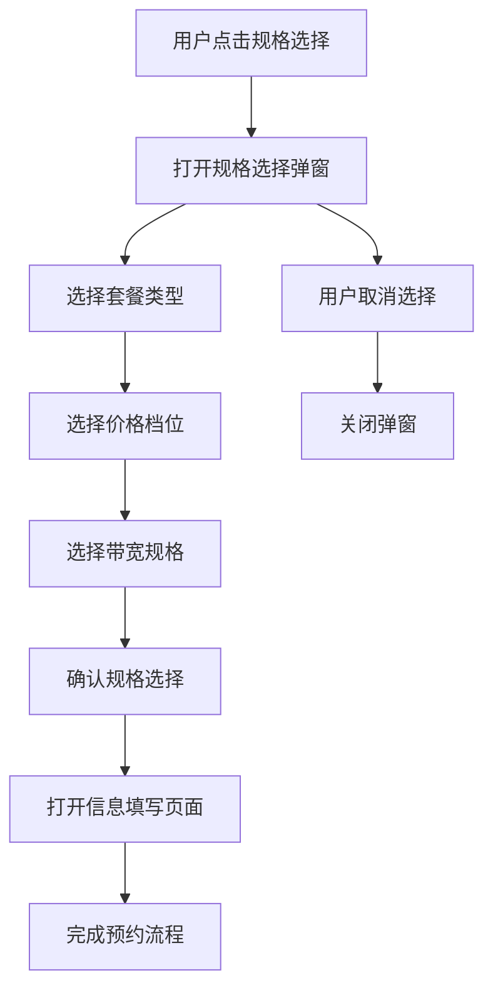

# 智慧酒店包规格选择弹窗

## 1. 页面概述

智慧酒店包规格选择弹窗是企业产品预约模块的核心交互组件，以弹窗形式展示产品规格选择界面，支持套餐类型、价格、带宽、电视和屏幕定制等选项的配置，并提供完整的信息填写流程。

### 1.1 页面定位
- **模块归属**：企业产品预约模块
- **页面类型**：规格选择弹窗页面
- **用户角色**：企业客户、潜在客户
- **主要功能**：产品规格配置、价格选择、预约引导

### 1.2 核心价值
- 提供直观的产品规格选择界面
- 支持灵活的套餐类型和价格配置
- 引导用户完成预约流程
- 提升用户购买决策效率

## 2. 业务流程

### 2.1 主要业务流程


### 2.2 详细操作流程

#### 2.2.1 弹窗打开流程
1. **触发选择**：用户点击"已选"或"立即预约"按钮
2. **弹窗显示**：系统打开规格选择弹窗(iframe)
3. **初始化数据**：加载产品规格配置和默认选择
4. **显示选项**：展示套餐类型、价格、带宽等选项

#### 2.2.2 规格选择流程
1. **套餐选择**：用户选择月包或年包
2. **价格选择**：用户选择价格档位(40/50/80/100/120元)
3. **带宽选择**：系统根据价格自动筛选可用带宽选项
4. **其他配置**：确认电视和屏幕定制选项
5. **选择确认**：用户确认规格配置

#### 2.2.3 数据同步流程
1. **数据收集**：收集所有选择的规格信息
2. **数据验证**：验证选择数据的完整性
3. **消息发送**：向父页面发送选择数据
4. **页面更新**：父页面更新显示选择结果

#### 2.2.4 流程继续流程
1. **确认选择**：用户点击确认按钮
2. **打开信息填写**：打开信息填写页面
3. **数据传递**：将选择数据传递给信息填写页面
4. **流程继续**：进入信息填写流程

### 2.3 异常处理流程
- **选择冲突**：自动调整可用选项，提示用户
- **数据验证失败**：显示错误提示，要求重新选择
- **弹窗通信失败**：降级到本地弹窗模式
- **页面加载失败**：显示错误提示，支持重试

## 3. 功能特点

### 3.1 规格选择系统
- **套餐类型选择**：支持月包和年包两种套餐类型
- **价格档位**：月包(40/50/80/100/120元)、年包(400/500/800/1000/1200元)
- **带宽选择**：100M、200M、300M、600M、1000M五个档位
- **电视配置**：商务电视IPTV选项
- **屏幕定制**：屏幕定制标准版选项

### 3.2 智能联动机制
- **价格带宽联动**：根据套餐类型和价格自动筛选可用带宽
- **SKU配置管理**：预定义的价格带宽组合规则
- **状态同步**：选择结果实时同步到父页面和子页面

### 3.3 弹窗交互设计
- **底部弹出**：从屏幕底部滑入的弹窗效果
- **遮罩层**：半透明黑色背景遮罩
- **关闭机制**：支持点击关闭按钮、ESC键、点击遮罩关闭
- **消息通信**：与父页面和子页面的完整消息传递机制

### 3.4 信息填写集成
- **无缝跳转**：规格选择完成后直接进入信息填写页面
- **数据传递**：选择结果完整传递给信息填写页面
- **流程管理**：完整的预约流程控制和状态管理

## 4. API接口

### 4.1 商品信息获取接口
- **接口名称**：商品信息获取接口
- **英文名称**：Get Product Information
- **调用地址**：`/api/product/getProductInfo`
- **请求方式**：GET/POST
- **功能描述**：获取智慧酒店包产品的详细信息
- **返回数据**：产品基本信息、价格配置、规格选项等

### 4.2 接口调用流程
1. **页面初始化**：调用商品信息获取接口
2. **数据解析**：解析返回的产品信息
3. **规格配置**：根据接口返回的规格配置初始化选择选项
4. **联动设置**：设置价格与带宽的联动关系

### 4.3 接口异常处理
- **超时处理**：设置合理的超时时间，超时后显示默认数据
- **错误处理**：接口调用失败时显示错误提示
- **重试机制**：支持用户手动重试接口调用

## 5. 关联的数据库表

### 5.1 省级产品信息表
- **表名称**：t_iqimall_product
- **主要字段**：产品ID、产品名称、价格、状态、创建时间等
- **用途**：存储智慧酒店包产品的基本信息

### 5.2 省级产品拓展信息表
- **表名称**：t_iqimall_product_ext_attr
- **主要字段**：产品ID、规格配置、套餐类型、带宽选项等
- **用途**：存储产品的扩展属性和规格配置信息

### 5.3 数据关联关系
- 通过产品ID关联两个表的数据
- 主表存储基本信息，扩展表存储规格配置
- 支持多规格、多套餐类型的产品配置

## 6. 测试要求

### 6.1 测试用例文档
- **完整测试用例**：[智慧酒店包产品详情页测试用例](https://scn19pp095sm.feishu.cn/base/Y6CZbC4HWaotEds1azBcsW0hnAg?from=from_copylink)

### 6.2 测试分类概览

#### 6.2.1 功能测试
- **弹窗打开测试**：验证弹窗正常打开和显示
- **规格选择测试**：验证套餐类型、价格、带宽选择功能
- **联动逻辑测试**：验证价格与带宽的联动关系
- **数据同步测试**：验证选择结果与父页面的数据同步
- **信息填写跳转测试**：验证跳转到信息填写页面的功能

#### 6.2.2 兼容性测试
- **移动端适配**：在不同尺寸的移动设备上测试
- **浏览器兼容**：在主流移动浏览器中测试
- **操作系统兼容**：在iOS和Android系统中测试
- **网络环境测试**：在不同网络环境下测试页面加载

#### 6.2.3 性能测试
- **弹窗打开速度**：测试弹窗打开和关闭的响应速度
- **选择响应时间**：测试规格选择的响应时间
- **数据同步性能**：测试数据同步的性能表现
- **内存使用**：测试长时间使用后的内存占用

#### 6.2.4 用户体验测试
- **操作流程测试**：验证完整的用户操作流程
- **错误处理测试**：测试各种异常情况的处理
- **视觉设计测试**：验证UI设计的视觉效果
- **交互反馈测试**：验证用户操作的反馈效果

#### 6.2.5 接口测试
- **接口调用测试**：验证商品信息获取接口的正常调用
- **数据解析测试**：验证接口返回数据的正确解析
- **异常处理测试**：测试接口异常情况的处理
- **数据同步测试**：验证弹窗与主页面的数据同步

#### 6.2.6 安全测试
- **XSS防护测试**：验证输入数据的安全性
- **CSRF防护测试**：验证跨站请求伪造防护
- **数据验证测试**：验证前端数据验证的完整性
- **权限控制测试**：验证页面访问权限控制

### 6.3 测试环境要求
- **测试设备**：多种移动设备（iPhone、Android手机、平板）
- **测试浏览器**：Safari、Chrome、微信内置浏览器等
- **测试网络**：WiFi、4G、5G等不同网络环境
- **测试数据**：准备完整的测试数据和异常数据

### 6.4 测试执行说明
- **测试用例覆盖**：详细测试用例请参考[测试用例文档](https://scn19pp095sm.feishu.cn/base/Y6CZbC4HWaotEds1azBcsW0hnAg?from=from_copylink)
- **测试优先级**：按功能重要性分为高、中、低三个优先级
- **测试执行顺序**：功能测试 → 兼容性测试 → 性能测试 → 用户体验测试 → 接口测试 → 安全测试
- **缺陷管理**：按严重程度分为严重、一般、轻微三个等级

## 7. 技术实现

### 7.1 页面结构
```html
智慧酒店包规格选择弹窗.html
├── 弹窗遮罩层 (modal-overlay)
├── 弹窗主体 (popup-container)
│   ├── 头部价格栏 (header)
│   │   ├── 产品缩略图
│   │   ├── 价格显示
│   │   └── 关闭按钮
│   ├── 内容区域 (content-area)
│   │   ├── 套餐类型选择 (packets)
│   │   ├── 价格选择 (filter-item)
│   │   ├── 带宽选择 (filter-item)
│   │   ├── 电视选择 (filter-item)
│   │   └── 屏幕定制选择 (filter-item)
│   └── 底部按钮 (footer)
├── 信息填写弹窗 (info-form-modal)
└── 成功弹窗 (success-modal)
```

### 核心功能模块

#### 1. SKU规格联动系统
```javascript
const skuConfig = {
    'month': {
        '40': ['100M'],
        '50': ['200M'],
        '80': ['300M'],
        '100': ['600M'],
        '120': ['1000M']
    },
    'year': {
        '400': ['100M'],
        '500': ['200M'],
        '800': ['300M'],
        '1000': ['600M'],
        '1200': ['1000M']
    }
};
```

#### 2. 消息通信机制
```javascript
// 向父窗口发送选择数据
window.parent.postMessage({
    type: 'updateSelection',
    selection: currentSelection
}, '*');

// 监听来自子页面的消息
window.addEventListener('message', function(event) {
    if (event.data.type === 'closeInfoForm') {
        closeInfoForm();
    }
});
```

#### 3. 弹窗状态管理
- **显示状态**：控制弹窗的显示和隐藏
- **数据状态**：管理当前选择的所有规格信息
- **流程状态**：控制整个预约流程的进度

### 样式设计

#### 弹窗布局
- **固定定位**：使用fixed定位确保弹窗在视口中央
- **底部弹出**：从屏幕底部滑入的动画效果
- **圆角设计**：顶部圆角20px，底部直角
- **阴影效果**：弹窗阴影增强层次感

#### 交互反馈
- **按钮状态**：选中状态的视觉反馈
- **悬停效果**：鼠标悬停时的颜色变化
- **点击反馈**：按钮点击时的缩放效果
- **禁用状态**：不可选选项的灰色显示

#### 响应式适配
- **移动端优先**：最大宽度375px的移动端设计
- **弹性布局**：使用flexbox确保各元素正确对齐
- **滚动处理**：内容区域支持垂直滚动

## 数据流程

### 1. 初始化流程
1. 页面加载完成
2. 初始化价格选项
3. 设置默认选择
4. 更新带宽选项状态

### 2. 选择更新流程
1. 用户选择套餐类型
2. 更新价格选项列表
3. 重新计算可用带宽
4. 更新UI显示状态

### 3. 提交流程
1. 验证选择完整性
2. 向父窗口发送选择数据
3. 显示信息填写弹窗
4. 传递数据到信息填写页面

### 4. 关闭流程
1. 用户点击关闭按钮
2. 向父窗口发送关闭消息
3. 父窗口移除iframe
4. 返回产品详情页

## 接口设计

### 消息类型定义
```javascript
// 更新选择数据
{
    type: 'updateSelection',
    selection: {
        packetType: 'month',
        price: 40,
        bandwidth: '100M',
        tv: '商务电视IPTV',
        screen: '屏幕定制标准版'
    }
}

// 关闭弹窗
{
    type: 'closeModal'
}

// 关闭信息填写弹窗
{
    type: 'closeInfoForm'
}
```

### 数据验证规则
- **必选验证**：套餐类型、价格、带宽必须选择
- **格式验证**：价格必须为数字类型
- **联动验证**：带宽必须与价格档位匹配

## 使用说明

### 页面访问
1. 通过产品详情页的"立即预约"按钮打开
2. 或通过"已选"规格区域点击打开
3. 支持直接访问进行独立测试

### 操作流程
1. **选择套餐类型**：点击月包或年包按钮
2. **选择价格档位**：从可用价格中选择
3. **选择带宽**：根据价格档位选择对应带宽
4. **确认选择**：点击"确认"按钮
5. **填写信息**：在信息填写页面完成预约信息
6. **提交预约**：完成整个预约流程

### 注意事项
- 弹窗设计为移动端优先，建议在手机设备上测试
- 价格和带宽具有严格的联动关系，不能随意组合
- 年包价格是月包价格的10倍
- 所有选择都会实时同步到父页面显示

## 更新记录

- **2024-01-XX**：创建初始版本
- **2024-01-XX**：添加SKU规格联动功能
- **2024-01-XX**：实现信息填写弹窗集成
- **2024-01-XX**：完善消息通信机制
- **2024-01-XX**：优化移动端交互体验

## 相关文件

- `智慧酒店包产品详情页.html` - 父页面
- `智慧酒店包信息填写页面.html` - 子页面
- `智慧酒店包提交成功弹窗.html` - 成功页面
- `banner.jpg` - 产品缩略图

## 联系方式

如有问题或建议，请联系开发团队。
