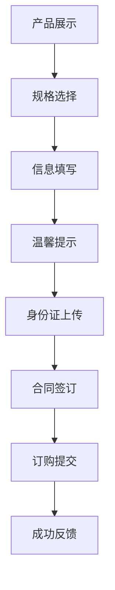

# 企业产品订购模块

## 1. 模块概述

企业产品订购模块是商品模板化需求的核心模块之一，主要用于企业用户对智慧酒店包等产品的完整订购服务。该模块提供从产品展示、规格选择、信息填写、温馨提示、身份证上传、合同签订到订购成功的完整流程，支持移动端和桌面端的用户交互体验。

### 1.1 模块定位
- **业务模式**：订购模式，适用于正式的产品订购和交易
- **目标用户**：企业客户、正式订购用户
- **核心价值**：提供完整合规的产品订购服务

### 1.2 模块特点
- **完整流程**：包含合规性验证和合同签订环节
- **安全保障**：增加身份验证和合同签订环节
- **移动优先**：专为移动端设计的响应式界面

## 2. 业务流程

### 2.1 主要业务流程


### 2.2 详细操作流程

#### 2.2.1 产品浏览流程
1. **页面加载**：用户访问智慧酒店包产品详情页
2. **信息展示**：系统展示产品基本信息、价格、图片
3. **Tab切换**：用户可在"商品"和"详情"Tab间切换
4. **滚动浏览**：用户滚动查看完整产品信息

#### 2.2.2 规格选择流程
1. **触发选择**：用户点击"已选"或"立即订购"按钮
2. **弹窗打开**：系统打开规格选择弹窗(iframe)
3. **套餐选择**：用户选择月包或年包
4. **价格选择**：用户选择价格档位(40/50/80/100/120元)
5. **带宽选择**：系统根据价格自动筛选可用带宽选项
6. **确认选择**：用户确认规格配置
7. **数据同步**：弹窗通过消息机制同步数据到主页面
8. **页面更新**：主页面更新显示选择结果

#### 2.2.3 信息填写流程
1. **进入页面**：用户进入信息填写页面
2. **地址选择**：选择安装地址（城市、楼宇）
3. **详细地址**：填写详细地址（楼栋、房间号）
4. **联系方式**：填写姓名和联系电话
5. **备注信息**：填写备注信息（可选）
6. **信息确认**：确认产品信息
7. **提交订购**：点击提交订购按钮

#### 2.2.4 温馨提示流程
1. **进入页面**：用户进入温馨提示页面
2. **阅读内容**：仔细阅读温馨提示内容
3. **承诺书**：阅读防范电信网络诈骗承诺书
4. **倒计时**：等待20秒倒计时结束
5. **确认勾选**：勾选同意承诺书
6. **继续流程**：点击确认按钮继续流程

#### 2.2.5 身份证上传流程
1. **进入页面**：用户进入身份证上传页面
2. **正面上传**：上传身份证正面照片
3. **自动识别**：等待自动识别完成
4. **反面上传**：上传身份证反面照片
5. **自动识别**：等待自动识别完成
6. **信息确认**：确认识别信息
7. **继续流程**：点击确认并继续按钮

#### 2.2.6 合同签订流程
1. **进入页面**：用户进入合同签订页面
2. **信息确认**：确认基本信息和套餐信息
3. **身份选择**：选择经办人身份（法人/经办人）
4. **签约方式**：选择签约方式（线上/线下）
5. **流程提醒**：查看业务流程提醒
6. **完成签约**：点击确认按钮完成签约

#### 2.2.7 订购成功流程
1. **状态展示**：显示订购成功状态
2. **反馈信息**：查看成功反馈信息
3. **后续操作**：选择后续操作：
   - 返回首页
   - 查询在途订单
4. **流程完成**：完成整个订购流程

## 3. 功能特点

### 3.1 产品展示功能
- **产品详情展示**：完整的智慧酒店包产品信息展示
- **图片轮播**：支持产品banner图片和详情图片展示
- **价格展示**：实时显示产品价格和套餐类型
- **规格预览**：展示产品规格和配置信息
- **分享功能**：支持二维码分享和推广文案链接复制

### 3.2 规格选择功能
- **套餐类型选择**：支持月包和年包选择
- **价格档位**：提供多种价格选项（40/50/80/100/120元等）
- **带宽选择**：支持100M-1000M带宽选项
- **智能联动**：价格与带宽选项的智能联动机制
- **SKU配置管理**：预定义的价格带宽组合规则
- **状态同步**：弹窗选择结果实时同步到主页面

### 3.3 信息收集功能
- **安装地址**：城市选择和具体楼宇选择
- **详细地址**：楼栋和房间号的分段输入
- **联系方式**：姓名和电话号码的并行输入
- **备注信息**：可选的备注说明输入
- **表单验证**：完整的表单验证机制

### 3.4 温馨提示功能
- **重要提示**：清晰展示身份证等资料上传要求
- **安全提醒**：强调防范电信网络诈骗的重要性
- **承诺书展示**：完整的防范电信网络诈骗承诺书
- **交互控制**：20秒倒计时和勾选确认机制

### 3.5 身份证上传功能
- **正面上传**：支持身份证正面照片上传
- **反面上传**：支持身份证反面照片上传
- **证照识别**：基于OCR技术自动识别身份证信息
- **信息验证**：验证身份证信息的真实性和有效性

### 3.6 合同签订功能
- **基本信息确认**：证件号码、联系电话、经办人身份
- **套餐信息展示**：订购套餐的详细信息
- **签约方式选择**：线上签约和线下签约选项
- **业务流程指引**：根据选择显示不同的业务流程

### 3.7 订购成功功能
- **成功状态展示**：订购成功的视觉反馈
- **导航功能**：返回首页和查询在途订单
- **状态反馈**：完整的订购状态展示
- **流程闭环**：完成整个订购流程的闭环

## 4. API接口

### 4.1 商品信息获取接口
- **接口名称**：商品信息获取接口
- **英文名称**：Get Product Information
- **调用地址**：`/api/product/getProductInfo`
- **请求方式**：GET/POST
- **功能描述**：获取智慧酒店包产品的详细信息
- **返回数据**：产品基本信息、价格配置、规格选项等

### 4.2 单点登录接口
- **接口名称**：单点登录接口
- **英文名称**：Single Sign-On
- **调用地址**：`/api/auth/sso`
- **请求方式**：POST
- **功能描述**：用户身份验证和授权
- **返回数据**：登录状态、用户信息、访问令牌

### 4.3 协议获取接口
- **接口名称**：协议获取接口
- **英文名称**：Get Agreement
- **调用地址**：`/api/agreement/getAgreement`
- **请求方式**：GET/POST
- **功能描述**：获取协议内容和承诺书
- **返回数据**：协议内容、版本信息等

### 4.4 证照识别接口
- **接口名称**：证照识别接口
- **英文名称**：ID Card Recognition
- **调用地址**：`/api/ocr/idCardRecognition`
- **请求方式**：POST
- **功能描述**：身份证信息识别和验证
- **返回数据**：识别结果、提取信息

### 4.5 合同获取接口
- **接口名称**：合同获取接口
- **英文名称**：Get Contract
- **调用地址**：`/api/contract/getContract`
- **请求方式**：GET/POST
- **功能描述**：获取合同模板和签约信息
- **返回数据**：合同模板、签约信息等

### 4.6 企业产品订购接口
- **接口名称**：企业产品订购接口
- **英文名称**：Submit Product Order
- **调用地址**：`/api/order/submitOrder`
- **请求方式**：POST
- **功能描述**：提交订购信息
- **返回数据**：订购结果、订单号、状态信息

## 5. 关联的数据库表

### 5.1 省级产品信息表
- **表名称**：t_iqimall_product
- **主要字段**：产品ID、产品名称、价格、状态、创建时间等
- **用途**：存储智慧酒店包产品的基本信息

### 5.2 省级产品拓展信息表
- **表名称**：t_iqimall_product_ext_attr
- **主要字段**：产品ID、规格配置、套餐类型、带宽选项等
- **用途**：存储产品的扩展属性和规格配置信息

### 5.3 数据关联关系
- 通过产品ID关联产品主表和扩展表
- 支持多规格、多套餐类型的产品配置
- 订单表关联用户信息和产品信息

## 6. 测试要求

### 6.1 测试用例文档
- **完整测试用例**：[智慧酒店包产品详情页测试用例](https://scn19pp095sm.feishu.cn/base/Y6CZbC4HWaotEds1azBcsW0hnAg?from=from_copylink)

### 6.2 测试分类概览

#### 6.2.1 功能测试
- **页面加载测试**：验证页面正常加载和渲染
- **规格选择测试**：验证套餐类型、价格、带宽选择功能
- **联动逻辑测试**：验证价格与带宽的联动关系
- **弹窗交互测试**：验证规格选择弹窗的打开、关闭、数据同步
- **分享功能测试**：验证二维码分享和链接复制功能
- **Tab切换测试**：验证商品和详情Tab的切换功能
- **温馨提示测试**：验证温馨提示页面和倒计时功能
- **身份证上传测试**：验证身份证上传和OCR识别功能
- **合同签订测试**：验证合同签订流程和签约方式选择

#### 6.2.2 兼容性测试
- **移动端适配**：在不同尺寸的移动设备上测试
- **浏览器兼容**：在主流移动浏览器中测试
- **操作系统兼容**：在iOS和Android系统中测试
- **网络环境测试**：在不同网络环境下测试页面加载

#### 6.2.3 性能测试
- **页面加载速度**：测试页面首次加载时间
- **图片加载优化**：验证图片懒加载和压缩效果
- **内存使用**：测试长时间使用后的内存占用
- **弹窗性能**：测试弹窗打开关闭的响应速度
- **文件上传性能**：测试身份证照片上传速度

#### 6.2.4 用户体验测试
- **操作流程测试**：验证完整的用户操作流程
- **错误处理测试**：测试各种异常情况的处理
- **视觉设计测试**：验证UI设计的视觉效果
- **交互反馈测试**：验证用户操作的反馈效果

#### 6.2.5 接口测试
- **接口调用测试**：验证所有接口的正常调用
- **数据解析测试**：验证接口返回数据的正确解析
- **异常处理测试**：测试接口异常情况的处理
- **数据同步测试**：验证弹窗与主页面的数据同步
- **OCR识别测试**：验证身份证识别接口的准确性

#### 6.2.6 安全测试
- **XSS防护测试**：验证输入数据的安全性
- **CSRF防护测试**：验证跨站请求伪造防护
- **数据验证测试**：验证前端数据验证的完整性
- **权限控制测试**：验证页面访问权限控制
- **文件上传安全测试**：验证身份证照片上传的安全性

### 6.3 测试环境要求
- **测试设备**：多种移动设备（iPhone、Android手机、平板）
- **测试浏览器**：Safari、Chrome、微信内置浏览器等
- **测试网络**：WiFi、4G、5G等不同网络环境
- **测试数据**：准备完整的测试数据和异常数据
- **OCR服务**：确保身份证识别服务可用

### 6.4 测试执行说明
- **测试用例覆盖**：详细测试用例请参考[测试用例文档](https://scn19pp095sm.feishu.cn/base/Y6CZbC4HWaotEds1azBcsW0hnAg?from=from_copylink)
- **测试优先级**：按功能重要性分为高、中、低三个优先级
- **测试执行顺序**：功能测试 → 兼容性测试 → 性能测试 → 用户体验测试 → 接口测试 → 安全测试
- **缺陷管理**：按严重程度分为严重、一般、轻微三个等级

## 7. 模块结构

### 7.1 原型页面组成
```
企业产品订购模块/
├── 原型01-智慧酒店包产品详情页/
│   ├── 智慧酒店包产品详情页.html
│   ├── 智慧酒店包产品详情页.md
│   ├── 接口/
│   │   └── 商品信息获取接口.md
│   └── 数据库表/
│       ├── 省级产品信息(t_iqimall_product).txt
│       └── 省级产品拓展信息(t_iqimall_product_ext_attr).txt
├── 原型02-智慧酒店包规格选择弹窗/
│   ├── 智慧酒店包规格选择弹窗.html
│   ├── 智慧酒店包规格选择弹窗.md
│   ├── 接口/
│   │   ├── 单点登录接口.txt
│   │   └── 商品信息获取接口.txt
│   └── 数据库表/
│       ├── 省级产品信息(t_iqimall_product).txt
│       └── 省级产品拓展信息(t_iqimall_product_ext_attr).txt
├── 原型03-智慧酒店包信息填写页面/
│   ├── 智慧酒店包信息填写页面.html
│   ├── 智慧酒店包信息填写页面.md
│   ├── 接口/
│   │   └── 商品信息获取接口.md
│   └── 数据库表/
│       ├── 省级产品信息(t_iqimall_product).txt
│       └── 省级产品拓展信息(t_iqimall_product_ext_attr).txt
├── 原型04-温馨提示页面/
│   ├── 温馨提示.html
│   ├── 温馨提示页面.md
│   ├── 接口/
│   │   └── 协议获取接口.md
│   └── 数据库表/
├── 原型05-身份证上传页面/
│   ├── 身份证上传页面.md
│   ├── 接口/
│   │   └── 证照识别接口.md
│   └── 数据库表/
├── 原型06-合同上传页面/
│   ├── 合同上传.html
│   ├── 合同上传页面.md
│   ├── 接口/
│   │   └── 合同获取接口.md
│   └── 数据库表/
├── 原型07-智慧酒店包提交成功页面/
│   ├── 智慧酒店包提交成功弹窗.html
│   ├── 智慧酒店包提交成功页面.md
│   ├── 订购成功.png
│   ├── 接口/
│   │   └── 企业产品订购接口.txt
│   └── 数据库表/
│       ├── 省级产品信息(t_iqimall_product).txt
│       └── 省级产品拓展信息(t_iqimall_product_ext_attr).txt
└── 企业产品订购原型合集/
    ├── banner.jpg
    ├── info.png
    ├── 合同上传.html
    ├── 智慧酒店包产品详情页.html
    ├── 智慧酒店包信息填写页面.html
    ├── 智慧酒店包提交成功弹窗.html
    ├── 智慧酒店包规格选择弹窗.html
    ├── 温馨提示.html
    ├── 订购成功.png
    └── 身份证上传.html
```

## 业务流程

### 1. 产品浏览流程
1. 用户访问智慧酒店包产品详情页
2. 浏览产品信息和图片
3. 查看产品规格和价格
4. 点击"已选"或"立即预约"按钮

### 2. 规格选择流程
1. 打开规格选择弹窗
2. 选择套餐类型（月包/年包）
3. 选择价格档位
4. 选择带宽（根据价格自动筛选）
5. 确认电视和屏幕定制选项
6. 点击确认按钮进入信息填写页面

### 3. 信息填写流程
1. 进入信息填写页面
2. 填写安装地址（城市、楼宇）
3. 填写详细地址（楼栋、房间号）
4. 填写姓名和联系电话
5. 填写备注信息（可选）
6. 确认产品信息
7. 点击提交预约按钮

### 4. 温馨提示流程
1. 进入温馨提示页面
2. 仔细阅读温馨提示内容
3. 阅读防范电信网络诈骗承诺书
4. 等待20秒倒计时结束
5. 勾选同意承诺书
6. 点击确认按钮继续流程

### 5. 身份证上传流程
1. 进入身份证上传页面
2. 上传身份证正面照片
3. 等待自动识别完成
4. 上传身份证反面照片
5. 等待自动识别完成
6. 确认识别信息
7. 点击确认并继续按钮

### 6. 合同签订流程
1. 进入合同签订页面
2. 确认基本信息和套餐信息
3. 选择经办人身份（法人/经办人）
4. 选择签约方式（线上/线下）
5. 查看业务流程提醒
6. 点击确认按钮完成签约

### 7. 订购成功流程
1. 显示订购成功状态
2. 查看成功反馈信息
3. 选择后续操作：
   - 返回首页
   - 查询在途订单
4. 完成整个订购流程

## 技术架构

### 1. 前端技术
- **HTML5**：页面结构和语义化标签
- **CSS3**：样式设计和响应式布局
- **JavaScript**：交互逻辑和数据处理
- **移动端适配**：支持移动端和桌面端

### 2. 交互设计
- **弹窗系统**：规格选择、信息填写、温馨提示等弹窗
- **消息通信**：页面间的数据传递机制
- **状态管理**：用户选择和页面状态管理
- **动画效果**：页面切换和交互动画

### 3. 数据流程
- **产品信息获取**：从服务器获取产品数据
- **规格配置管理**：SKU规格联动配置
- **表单数据处理**：用户输入数据的收集和验证
- **身份证识别**：OCR技术识别身份证信息
- **合同信息处理**：签约信息的收集和处理
- **订购信息提交**：订购数据的提交和确认

## 接口设计

### 1. 商品信息获取接口
- **接口名称**：商品信息获取接口
- **请求方式**：GET/POST
- **请求参数**：产品ID
- **返回数据**：产品详细信息、规格配置、价格信息

### 2. 单点登录接口
- **接口名称**：单点登录接口
- **请求方式**：POST
- **请求参数**：用户凭证
- **返回数据**：登录状态、用户信息、访问令牌

### 3. 协议获取接口
- **接口名称**：协议获取接口
- **请求方式**：GET/POST
- **请求参数**：协议类型
- **返回数据**：协议内容、版本信息等

### 4. 证照识别接口
- **接口名称**：证照识别接口
- **请求方式**：POST
- **请求参数**：图片数据、类型
- **返回数据**：识别结果、提取信息

### 5. 合同获取接口
- **接口名称**：合同获取接口
- **请求方式**：GET/POST
- **请求参数**：用户ID、套餐信息
- **返回数据**：合同模板、签约信息等

### 6. 企业产品订购接口
- **接口名称**：企业产品订购接口
- **请求方式**：POST
- **请求参数**：订购信息、用户信息、合同信息
- **返回数据**：订购结果、订单号、状态信息

## 数据库表结构

### 1. 省级产品信息表(t_iqimall_product)
- **表用途**：存储产品基本信息
- **主要字段**：
  - product_id：产品ID
  - product_name：产品名称
  - product_price：产品价格
  - product_spec：产品规格
  - product_status：产品状态

### 2. 省级产品拓展信息表(t_iqimall_product_ext_attr)
- **表用途**：存储产品扩展属性
- **主要字段**：
  - product_id：产品ID
  - attr_type：属性类型
  - attr_value：属性值
  - attr_desc：属性描述

## 使用说明

### 1. 模块部署
- 确保所有HTML文件和相关资源正确部署
- 配置接口服务地址和数据库连接
- 设置移动端和桌面端的访问权限
- 配置身份证识别服务

### 2. 功能测试
- 测试产品信息展示功能
- 验证规格选择联动机制
- 检查表单验证和提交流程
- 测试身份证识别功能
- 验证合同签订流程
- 确认订购成功状态展示

### 3. 注意事项
- 确保产品图片资源正确加载
- 验证SKU规格配置的准确性
- 检查接口调用的稳定性
- 测试移动端兼容性
- 确保身份证识别服务可用
- 验证合同模板的正确性

## 更新记录

### 版本1.0.0 (2024-01-01)
- 初始版本发布
- 实现完整的企业产品订购流程
- 支持移动端和桌面端访问
- 集成所有核心功能模块
- 支持身份证识别和合同签订

## 相关文档

- [智慧酒店包产品详情页](原型01-智慧酒店包产品详情页/智慧酒店包产品详情页.md)
- [智慧酒店包规格选择弹窗](原型02-智慧酒店包规格选择弹窗/智慧酒店包规格选择弹窗.md)
- [智慧酒店包信息填写页面](原型03-智慧酒店包信息填写页面/智慧酒店包信息填写页面.md)
- [温馨提示页面](原型04-温馨提示页面/温馨提示页面.md)
- [身份证上传页面](原型05-身份证上传页面/身份证上传页面.md)
- [合同上传页面](原型06-合同上传页面/合同上传页面.md)
- [智慧酒店包提交成功页面](原型07-智慧酒店包提交成功页面/智慧酒店包提交成功页面.md)

## 联系方式

如有问题或建议，请联系开发团队。

---

*本文档最后更新时间：2024-01-01*
