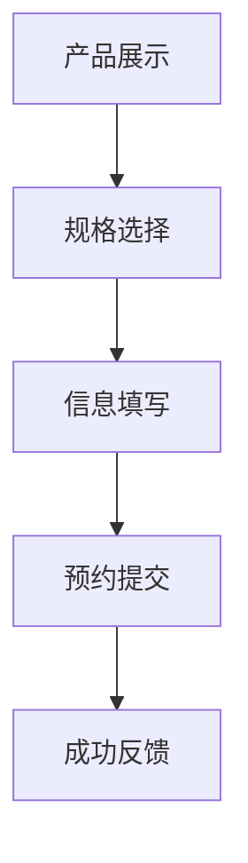
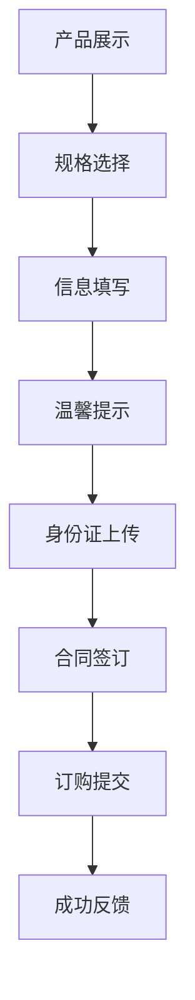

# 需求01-商品模板化需求

## 1. 需求概述

### 1.1 需求背景
商品模板化需求旨在为企业用户提供标准化的智慧酒店包产品展示和订购服务，通过模块化的设计理念，实现预约和订购两种业务模式的统一管理。该需求以移动端优先的设计理念，为企业用户提供便捷、高效的产品体验流程。

### 1.2 核心业务价值
- **标准化流程**：建立统一的商品展示、规格选择、信息收集、成功反馈的业务流程
- **双模式支持**：同时支持预约模式和订购模式，满足不同业务场景需求
- **移动端优化**：专为移动设备设计的响应式界面，提升用户体验
- **合规性保障**：在订购流程中增加温馨提示、身份证验证、合同签订等合规环节

### 1.3 目标用户
- **企业客户**：需要智慧酒店包产品的企业用户
- **潜在客户**：对产品感兴趣的企业用户
- **系统管理员**：负责产品配置和订单管理的后台用户

## 2. 业务流程

### 2.1 预约业务流程

**流程特点**：
- 简化流程，快速完成预约
- 重点收集用户基本信息和产品需求
- 适用于初步意向收集和需求调研

### 2.2 订购业务流程

**流程特点**：
- 完整合规流程，确保交易安全
- 增加身份验证和合同签订环节
- 适用于正式的产品订购和交易

## 3. 功能特点

### 3.1 模块化设计
- **独立开发**：每个功能模块独立开发，便于维护和扩展
- **文档对应**：原型页面、接口文档、数据库表一一对应
- **测试支持**：支持单独测试和集成测试

### 3.2 数据驱动
- **动态获取**：产品信息通过接口动态获取
- **智能联动**：规格选择支持智能联动
- **实时验证**：用户操作数据实时传递和验证

### 3.3 响应式设计
- **移动优先**：移动端优先的界面设计
- **自适应**：支持不同屏幕尺寸的自适应
- **统一体验**：统一的视觉风格和交互体验

## 4. 分模块功能描述

### 4.1 模块01-企业产品预约模块

#### 4.1.1 模块概述
企业产品预约模块专注于快速收集用户的产品需求和基本信息，适用于初步意向收集和需求调研场景。该模块包含4个核心原型页面，形成完整的预约业务流程。

#### 4.1.2 原型页面功能描述

**原型01-智慧酒店包产品详情页**
- **功能定位**：产品信息展示和预约入口
- **核心功能**：
  - 动态产品标题展示：`【爱企商城】智慧酒店包{价格}元{套餐类型}`
  - 产品图片轮播和详情展示
  - 规格选择弹窗集成
  - 产品分享功能（二维码生成、链接复制）
- **交互特点**：点击"立即预约"按钮触发规格选择流程

**原型02-智慧酒店包规格选择弹窗**
- **功能定位**：产品规格和价格选择
- **核心功能**：
  - 套餐类型选择（月包/年包）
  - 价格档位选择（40/50/80/100/120元等）
  - 带宽选择（100M-1000M）
  - 智能联动机制（价格与带宽选项联动）
- **交互特点**：弹窗形式，支持关闭和确认操作

**原型03-智慧酒店包信息填写页面**
- **功能定位**：用户信息收集和预约提交
- **核心功能**：
  - 安装地址选择（城市、楼宇）
  - 详细地址填写（楼栋、房间号）
  - 联系方式收集（姓名、电话）
  - 备注信息输入
  - 表单验证和提交
- **交互特点**：iframe容器页面，支持子页面动态加载

**原型04-智慧酒店包提交成功页面**
- **功能定位**：预约成功反馈和后续操作引导
- **核心功能**：
  - 预约成功状态展示
  - 返回首页功能
  - 查询在途订单功能
- **交互特点**：成功页面，提供后续操作选项

#### 4.1.3 接口与数据库表关系

| 原型页面 | 主要接口 | 主要数据表 | 数据流向 |
|---------|---------|-----------|---------|
| 原型01-智慧酒店包产品详情页 | [商品信息获取接口](../接口/商品信息获取接口.md) | [省级产品信息(t_iqimall_product)](../数据库表/t_iqimall_product.md) [省级产品拓展信息(t_iqimall_product_ext_attr)](../数据库表/t_iqimall_product_ext_attr.md) | 获取产品基础信息和扩展属性，用于页面展示 |
| 原型02-智慧酒店包规格选择弹窗 | [商品信息获取接口](../接口/商品信息获取接口.md) | [省级产品信息(t_iqimall_product)](../数据库表/t_iqimall_product.md) [省级产品拓展信息(t_iqimall_product_ext_attr)](../数据库表/t_iqimall_product_ext_attr.md) | 获取产品规格配置，支持价格带宽联动 |
| 原型03-智慧酒店包信息填写页面 | [商品信息获取接口](../接口/商品信息获取接口.md) 地图信息获取接口 用户信息获取接口 | [省级产品信息(t_iqimall_product)](../数据库表/t_iqimall_product.md) [省级产品拓展信息(t_iqimall_product_ext_attr)](../数据库表/t_iqimall_product_ext_attr.md) | 获取产品信息、地图数据、用户信息，用于表单预填和验证 |
| 原型04-智慧酒店包提交成功页面 | [企业产品预约提交接口](../接口/企业产品预约提交接口.md) | [个人预约订单表(t_gr_reservation_order)](../数据库表/t_gr_reservation_order.md) [省级产品信息(t_iqimall_product)](../数据库表/t_iqimall_product.md) [省级产品拓展信息(t_iqimall_product_ext_attr)](../数据库表/t_iqimall_product_ext_attr.md) | 提交预约数据，关联产品信息，生成预约订单 |

### 4.2 模块02-企业产品订购模块

#### 4.2.1 模块概述
企业产品订购模块提供完整的产品订购服务，包含合规性验证和合同签订环节，适用于正式的产品订购和交易场景。该模块包含7个核心原型页面，形成完整的订购业务流程。

#### 4.2.2 原型页面功能描述

**原型01-智慧酒店包产品详情页**
- **功能定位**：产品信息展示和订购入口
- **核心功能**：
  - 动态产品标题展示：`【爱企商城】智慧酒店包{价格}元{套餐类型}`
  - 产品图片轮播和详情展示
  - 规格选择弹窗集成
  - 产品分享功能（二维码生成、链接复制）
- **交互特点**：点击"立即订购"按钮触发规格选择流程

**原型02-智慧酒店包规格选择弹窗**
- **功能定位**：产品规格和价格选择
- **核心功能**：
  - 套餐类型选择（月包/年包）
  - 价格档位选择（40/50/80/100/120元等）
  - 带宽选择（100M-1000M）
  - 智能联动机制（价格与带宽选项联动）
- **交互特点**：弹窗形式，支持关闭和确认操作

**原型03-智慧酒店包信息填写页面**
- **功能定位**：用户信息收集和订购提交
- **核心功能**：
  - 安装地址选择（城市、楼宇）
  - 详细地址填写（楼栋、房间号）
  - 联系方式收集（姓名、电话）
  - 备注信息输入
  - 表单验证和提交
- **交互特点**：iframe容器页面，支持子页面动态加载

**原型04-温馨提示页面**
- **功能定位**：合规性提示和承诺书确认
- **核心功能**：
  - 重要提示信息展示
  - 防范电信网络诈骗承诺书
  - 20秒倒计时功能
  - 勾选确认机制
- **交互特点**：强制阅读时间，确保用户了解相关条款

**原型05-身份证上传页面**
- **功能定位**：身份验证和证件识别
- **核心功能**：
  - 身份证正面上传
  - 身份证反面上传
  - OCR自动识别功能
  - 信息验证机制
- **交互特点**：文件上传，自动识别，信息验证

**原型06-合同上传页面**
- **功能定位**：合同签订和信息确认
- **核心功能**：
  - 基本信息确认
  - 套餐信息展示
  - 签约方式选择（线上/线下）
  - 业务流程指引
- **交互特点**：信息确认，签约方式选择

**原型07-智慧酒店包提交成功页面**
- **功能定位**：订购成功反馈和后续操作引导
- **核心功能**：
  - 订购成功状态展示
  - 返回首页功能
  - 查询在途订单功能
- **交互特点**：成功页面，提供后续操作选项

#### 4.2.3 接口与数据库表关系

| 原型页面 | 主要接口 | 主要数据表 | 数据流向 |
|---------|---------|-----------|---------|
| 原型01-智慧酒店包产品详情页 | [商品信息获取接口](../接口/商品信息获取接口.md) | [省级产品信息(t_iqimall_product)](../数据库表/t_iqimall_product.md) [省级产品拓展信息(t_iqimall_product_ext_attr)](../数据库表/t_iqimall_product_ext_attr.md) | 获取产品基础信息和扩展属性，用于页面展示 |
| 原型02-智慧酒店包规格选择弹窗 | [单点登录接口](../接口/单点登录接口.md) [商品信息获取接口](../接口/商品信息获取接口.md) | [省级产品信息(t_iqimall_product)](../数据库表/t_iqimall_product.md) [省级产品拓展信息(t_iqimall_product_ext_attr)](../数据库表/t_iqimall_product_ext_attr.md) | 用户身份验证，获取产品规格配置 |
| 原型03-智慧酒店包信息填写页面 | [商品信息获取接口](../接口/商品信息获取接口.md) | [省级产品信息(t_iqimall_product)](../数据库表/t_iqimall_product.md) [省级产品拓展信息(t_iqimall_product_ext_attr)](../数据库表/t_iqimall_product_ext_attr.md) | 获取产品信息，用于表单预填和验证 |
| 原型04-温馨提示页面 | [协议获取接口](../接口/协议获取接口.md) | - | 获取协议内容和承诺书文本 |
| 原型05-身份证上传页面 | [证照识别接口](../接口/证照识别接口.md) | - | 身份证信息识别和验证 |
| 原型06-合同上传页面 | [合同获取接口](../接口/合同获取接口.md) | - | 获取合同模板和签约信息 |
| 原型07-智慧酒店包提交成功页面 | [企业产品订购接口](../接口/企业产品订购接口.md) | [省级产品信息(t_iqimall_product)](../数据库表/t_iqimall_product.md) [省级产品拓展信息(t_iqimall_product_ext_attr)](../数据库表/t_iqimall_product_ext_attr.md) [企业订单表(t_enterprise_order)](../数据库表/t_enterprise_order.md) | 提交订购数据，关联产品信息，生成订购订单 |

## 5. API接口

### 5.1 接口概览
系统包含多个API接口，支持产品信息获取、用户认证、数据提交等功能。

### 5.2 主要接口列表
- **[商品信息获取接口](../接口/商品信息获取接口.md)**：获取产品详细信息和规格配置
- **[单点登录接口](../接口/单点登录接口.md)**：用户身份验证和授权
- **[协议获取接口](../接口/协议获取接口.md)**：获取协议内容和承诺书
- **[证照识别接口](../接口/证照识别接口.md)**：身份证信息识别和验证
- **[合同获取接口](../接口/合同获取接口.md)**：获取合同模板和签约信息
- **[企业产品预约提交接口](../接口/企业产品预约提交接口.md)**：提交预约信息
- **[企业产品订购接口](../接口/企业产品订购接口.md)**：提交订购信息

## 6. 关联的数据库表

### 6.1 主要数据表
- **[省级产品信息表(t_iqimall_product)](../数据库表/t_iqimall_product.md)**：存储产品基本信息
- **[省级产品拓展信息表(t_iqimall_product_ext_attr)](../数据库表/t_iqimall_product_ext_attr.md)**：存储产品扩展属性
- **[个人预约订单表(t_gr_reservation_order)](../数据库表/t_gr_reservation_order.md)**：存储预约订单信息
- **[企业订单表(t_enterprise_order)](../数据库表/t_enterprise_order.md)**：存储企业订购订单信息
- **[用户信息表(t_user_info)](../数据库表/t_user_info.md)**：存储用户基本信息
- **[用户认证表(t_user_auth)](../数据库表/t_user_auth.md)**：存储用户认证信息
- **[操作日志表(t_operation_log)](../数据库表/t_operation_log.md)**：存储系统操作日志
- **[系统配置表(t_system_config)](../数据库表/t_system_config.md)**：存储系统配置信息

### 6.2 数据关联关系
- 通过产品ID关联产品主表和扩展表
- 订单表关联用户信息和产品信息
- 支持多规格、多套餐类型的产品配置

## 7. 测试要求

### 7.1 测试环境准备

#### 7.1.1 测试环境要求
- **浏览器支持**：Chrome、Firefox、Safari、Edge等主流浏览器
- **设备支持**：手机端（375px宽度）、平板端、桌面端
- **网络环境**：支持HTTP/HTTPS协议访问
- **图片资源**：确保banner.jpg、info.png等图片资源可正常加载

#### 7.1.2 测试数据准备
- **产品数据**：准备智慧酒店包产品的测试数据
- **用户数据**：准备测试用户的基本信息
- **地图数据**：准备城市和楼宇的测试数据
- **接口数据**：确保所有接口返回正确的测试数据

### 7.2 功能测试

#### 7.2.1 模块01-企业产品预约模块测试

**测试流程**：产品详情页 → 规格选择 → 信息填写 → 提交成功

**测试用例**：

1. **产品详情页测试**
   - 验证产品标题动态更新功能
   - 测试产品图片轮播功能
   - 验证"立即预约"按钮点击响应
   - 测试产品分享功能（二维码生成、链接复制）

2. **规格选择弹窗测试**
   - 验证套餐类型选择功能（月包/年包）
   - 测试价格档位选择功能
   - 验证带宽选择功能
   - 测试价格与带宽的智能联动机制
   - 验证弹窗关闭和确认操作

3. **信息填写页面测试**
   - 验证城市选择功能
   - 测试楼宇选择功能
   - 验证详细地址填写功能
   - 测试姓名和电话输入功能
   - 验证表单验证机制
   - 测试"提交预约"按钮功能

4. **提交成功页面测试**
   - 验证预约成功状态展示
   - 测试"返回首页"按钮功能
   - 验证"查询在途订单"按钮功能

#### 7.2.2 模块02-企业产品订购模块测试

**测试流程**：产品详情页 → 规格选择 → 信息填写 → 温馨提示 → 身份证上传 → 合同签订 → 提交成功

**测试用例**：

1. **产品详情页测试**
   - 验证产品标题动态更新功能
   - 测试产品图片轮播功能
   - 验证"立即订购"按钮点击响应
   - 测试产品分享功能（二维码生成、链接复制）

2. **规格选择弹窗测试**
   - 验证套餐类型选择功能（月包/年包）
   - 测试价格档位选择功能
   - 验证带宽选择功能
   - 测试价格与带宽的智能联动机制
   - 验证弹窗关闭和确认操作

3. **信息填写页面测试**
   - 验证城市选择功能
   - 测试楼宇选择功能
   - 验证详细地址填写功能
   - 测试姓名和电话输入功能
   - 验证表单验证机制
   - 测试"提交订购"按钮功能

4. **温馨提示页面测试**
   - 验证温馨提示内容展示
   - 测试防范电信网络诈骗承诺书展示
   - 验证20秒倒计时功能
   - 测试勾选确认机制
   - 验证倒计时结束后按钮可用性

5. **身份证上传页面测试**
   - 验证身份证正面上传功能
   - 测试身份证反面上传功能
   - 验证OCR自动识别功能
   - 测试信息验证机制
   - 验证"确认并继续"按钮功能

6. **合同上传页面测试**
   - 验证基本信息确认功能
   - 测试套餐信息展示功能
   - 验证签约方式选择功能（线上/线下）
   - 测试业务流程指引功能
   - 验证"确认"按钮功能

7. **提交成功页面测试**
   - 验证订购成功状态展示
   - 测试"返回首页"按钮功能
   - 验证"查询在途订单"按钮功能

### 7.3 兼容性测试

#### 7.3.1 浏览器兼容性测试
- **Chrome浏览器**：验证所有功能正常运行
- **Firefox浏览器**：验证所有功能正常运行
- **Safari浏览器**：验证所有功能正常运行
- **Edge浏览器**：验证所有功能正常运行

#### 7.3.2 设备兼容性测试
- **手机端测试**：375px宽度，验证移动端适配效果
- **平板端测试**：768px宽度，验证平板端适配效果
- **桌面端测试**：1200px宽度，验证桌面端适配效果

### 7.4 性能测试

#### 7.4.1 页面加载性能测试
- **首屏加载时间**：验证页面首屏加载时间在3秒内
- **图片加载性能**：验证banner.jpg、info.png等图片加载速度
- **接口响应时间**：验证所有接口响应时间在2秒内

#### 7.4.2 交互性能测试
- **按钮响应时间**：验证所有按钮点击响应时间在1秒内
- **页面切换性能**：验证页面间切换流畅度
- **弹窗显示性能**：验证弹窗显示和隐藏的流畅度

### 7.5 测试工具和方法

#### 7.5.1 测试工具
- **浏览器开发者工具**：用于调试和性能分析
- **移动端模拟器**：用于移动端测试
- **网络抓包工具**：用于接口测试
- **自动化测试工具**：用于回归测试

#### 7.5.2 测试方法
- **手动测试**：逐功能点进行手工测试
- **自动化测试**：编写自动化测试脚本
- **用户验收测试**：邀请真实用户进行测试
- **压力测试**：模拟高并发访问场景

### 7.6 测试报告

#### 7.6.1 测试结果记录
- **功能测试结果**：记录每个功能点的测试结果
- **兼容性测试结果**：记录不同浏览器和设备的测试结果
- **性能测试结果**：记录页面加载和交互性能数据
- **问题记录**：记录测试过程中发现的问题和解决方案

#### 7.6.2 测试结论
- **功能完整性**：评估功能实现的完整性
- **用户体验**：评估用户界面的友好性
- **性能表现**：评估系统性能表现
- **部署建议**：提供部署和上线建议

---

**文档版本**: v4.0  
**创建日期**: 2024年12月  
**最后更新**: 2024年12月  
**维护人员**: 开发团队
